# Fabric AI Ready Data Day1 ハンズオン手順（PDP v2 版）

## 目次

- [Fabric AI Ready Data Day1 ハンズオン手順](#fabric-ai-ready-data-day1-ハンズオン手順)
  - [目次](#目次)
    - [事前確認](#事前確認)
    - [本日のハンズオン内容](#本日のハンズオン内容)
  - [事前準備 1 Azure](#事前準備-1-azure)
  - [Fabric にレイクハウスとウェアハウスを作成する](#fabric-にレイクハウスとウェアハウスを作成する)
  - [SQL Database のミラーリングを作成する](#sql-database-のミラーリングを作成する)
  - [Event Hubs からリアルタイムデータを取り入れる](#event-hubs-からリアルタイムデータを取り入れる)
  - [セマンティックモデルを元にデータエージェントを作成する](#セマンティックモデルを元にデータエージェントを作成する)

### 事前確認

- Azure ポータルでリソースグループに接続でき、リソースを作成する権限が付与されている。
  > 作業用のリソースグループに対して共同作成者およびユーザーアクセス管理者権限が付与されている。
  >
- Fabric ポータルにインターネットで接続できる。
- Fabric Free ライセンス、Power BI Pro ライセンスが付与されている。

### 本日のハンズオン内容

本日作成するアーキテクチャは、次のとおりである。

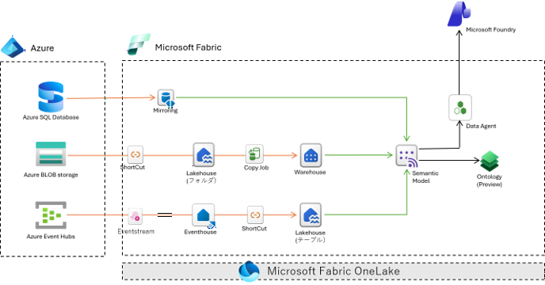

本日使用する元データは、次の URL に公開されているデータを、当ハンズオン用に加工したものである。

**参考 URL**

[Release Wide World Importers sample database v1.0 · microsoft/sql-server-samples (github.com)](https://github.com/Microsoft/sql-server-samples/releases/tag/wide-world-importers-v1.0)

## 事前準備 1 Azure

本手順では、Azure ポータルで Blob Storage、Event Hubs、SQL Database の各リソースを作成する。

本手順では次のファイルを使用する。

- [fact\_sale.parquet]
- [pdpv2db.bacpac]

これらのファイルはコーチより受け取り、各自端末の任意のフォルダにコピーしておく。

1. Azure ポータルにログインして、次の名前でリソースグループを作成する。
   `pdpv2handson＜No＞`
2. ブラウザで新しいタブを開き、次の URL に接続する。
   [https://portal.azure.com/#create/Microsoft.Template/uri/https%3A%2F%2Fraw.githubusercontent.com%2FAzure%2Fazure-sdk-for-net%2Fmain%2Fsdk%2Feventhub%2FAzure.Messaging.EventHubs.Processor%2Fassets%2Fsamples-azure-deploy.json](https://portal.azure.com/#create/Microsoft.Template/uri/https%3A%2F%2Fraw.githubusercontent.com%2FAzure%2Fazure-sdk-for-net%2Fmain%2Fsdk%2Feventhub%2FAzure.Messaging.EventHubs.Processor%2Fassets%2Fsamples-azure-deploy.json)
   > ※ ログインが求められる場合は、当ハンズオン用のテナントで自身に割り当てられたアカウントでログインする。
   > ※ ログイン先が当ハンズオン用に割り当てられたサブスクリプションであることを確認しておく。
   >
3. [カスタム デプロイ] 画面で次の内容を入力し、Event Hubs 及び Blob Storage を作成する。

　| 属性 | 値 |
| --- | --- |
| サブスクリプション | 当ハンズオン用に割り当てられたサブスクリプション |
| リソース グループ | 当該手順 1. で作成したものを選択（pdpv2handson＜No＞） |
| リージョン | Japan East |
| Namespace Name | pdpv2eventhubnamespace＜No＞ |
| Event Hub Name | pdpv2eventhubname＜No＞ |
| Storage Account Name | pdpv2storage＜No＞ |
| Blob Container Name | salescontainer |

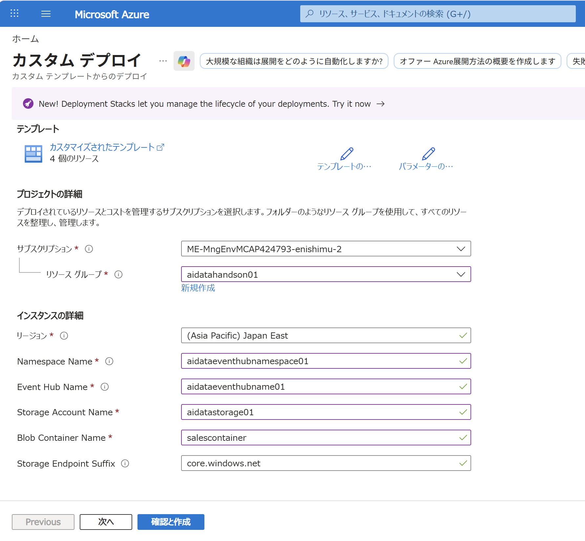
4. 作成された Blob Storage を開き、次の設定を行う。
**アクセス制御 (IAM)**　：　**ロールの割り当ての追加** で自身のアカウントに **ストレージ BLOB データ共同作成者** を割り当てる。
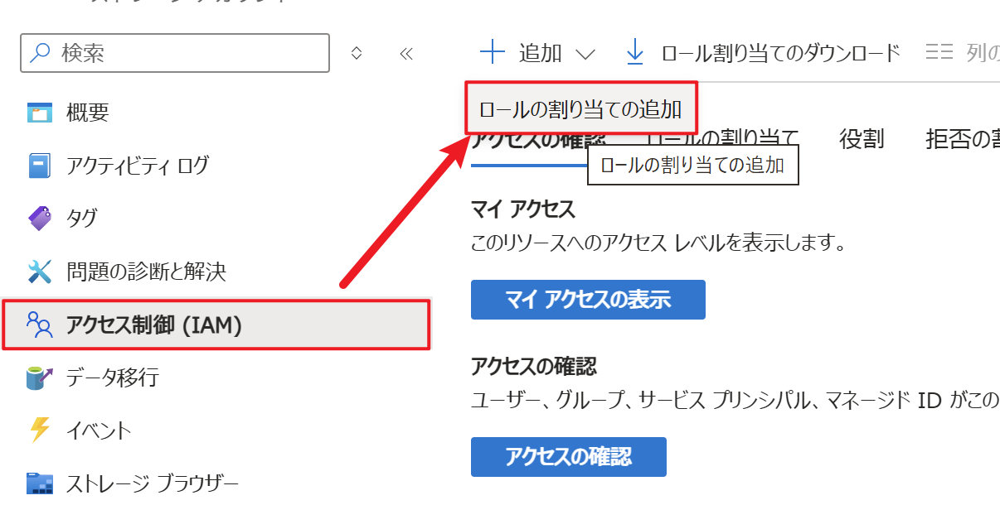
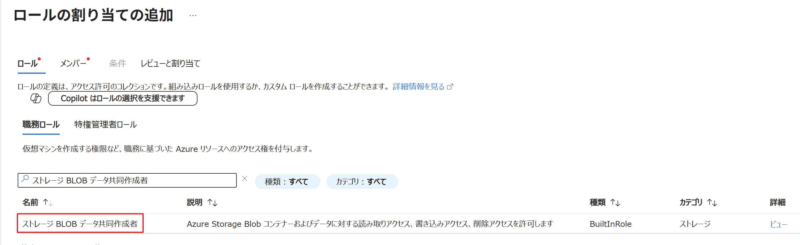
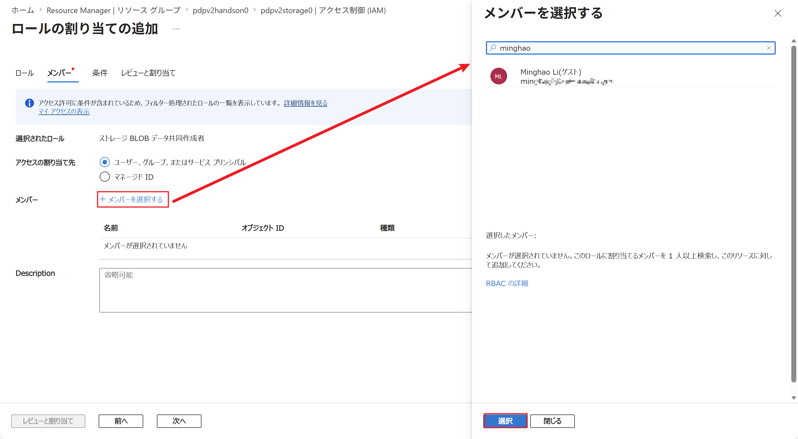

> ※ 当ハンズオンはすべてのネットワークからの接続を有効にして行うが、実際のプロジェクトにおいては、セキュリティを考慮したネットワーク設定が必要となるので注意する。

5. Blob Storage の **ストレージ ブラウザー** を開き、作成されている `salescontainer` にコーチから配布された `fact\_sale.parquet`, `pdpv2db.bacpac` ファイルをアップロードする。
   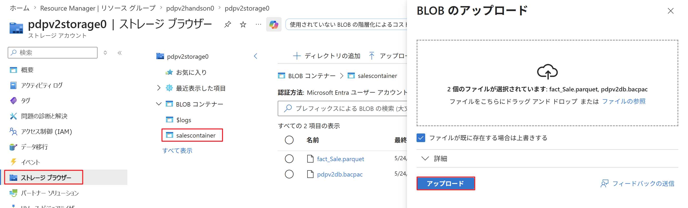
6. （当ハンズオン参加者が自身の容量を必要とする場合）次の内容でFabric 容量のリソースを作成する。


| 属性               | 値                                                                   |
| ------------------ | -------------------------------------------------------------------- |
| サブスクリプション | 当ハンズオン用に割り当てられたサブスクリプション                     |
| リソース グループ  | 当該手順 1. で作成したものを選択（pdpv2handson＜No＞）              |
| 容量の名前         | pdpv2fabricsku＜No＞                                                |
| リージョン         | Japan East                                                           |
| サイズ             | ＜コーチより指示＞                                                   |
| 容量管理者         | ＜Fabric の容量管理者となる Entra ID アカウント名(@ドメイン名含む)＞ |

> ※ ＜＞内は自身の環境に応じて適宜書き換える。
> ※ サイズは容量内で作業を行う人数により変わるため、コーチの指示内容で指定する。
> ※ 当ハンズオンは作業者自身のアカウントを使用するが、運用時は、セキュリティを考慮した権限設定が必要となるので注意すること。

7. Azure ポータル右上の Cloud Shell を開き、次のコマンドを実行して、SQL Database の論理サーバーを作成する。

```bash
az account set --subscription "＜サブスクリプション名＞"
server="pdpv2sqldbserver＜No＞"
adminuser="＜SQL Database のサーバー管理者となる Entra ID アカウント名(@ドメイン名含む)＞"
adminsid="＜adminuser のオブジェクト ID＞"
az sql server create --name $server --resource-group "dpv2handson＜No＞" --location "japaneast" --enable-ad-only-auth --external-admin-principal-type User --external-admin-name $adminuser --external-admin-sid $adminsid
```

> ※ ＜＞内は自身の環境に応じて適宜書き換える。

8. 作成された SQL Serverを開き、次の設定を行う。

**アクセス制御 (IAM)**：　[ロールの割り当ての追加] で自身のアカウントに [SQL Server 共同作成者] を割り当てる。

**セキュリティ** -> **ネットワーク**：　パブリック接続を有効化する。自身の端末のクライアント IP アドレスを追加する。[Azure サービスおよびリソースにこのサーバーへのアクセスを許可する] にチェックを入れる。

**セキュリティ** -> **ID**　：　システム割り当てマネージド ID の状態を [オン] に変更する。

> ※ 当ハンズオンはすべてのネットワークからの接続を有効にして行うが、実際のプロジェクトにおいては、セキュリティを考慮したネットワーク設定が必要となるので注意する。

9. コーチから配布された [pdpv2db.bacpac] ファイルを用い、データベースをインポートする。


| 属性                     | 値       |
| ------------------------ | -------- |
| データベース名           | pdpv2db |
| エディション             | Standard |
| データベースの最大サイズ | 10GB     |
| サービスの目標           | S3       |

> ※ SQL Server Management Studio から行うときのパラメータは上記を指定する。
>
> 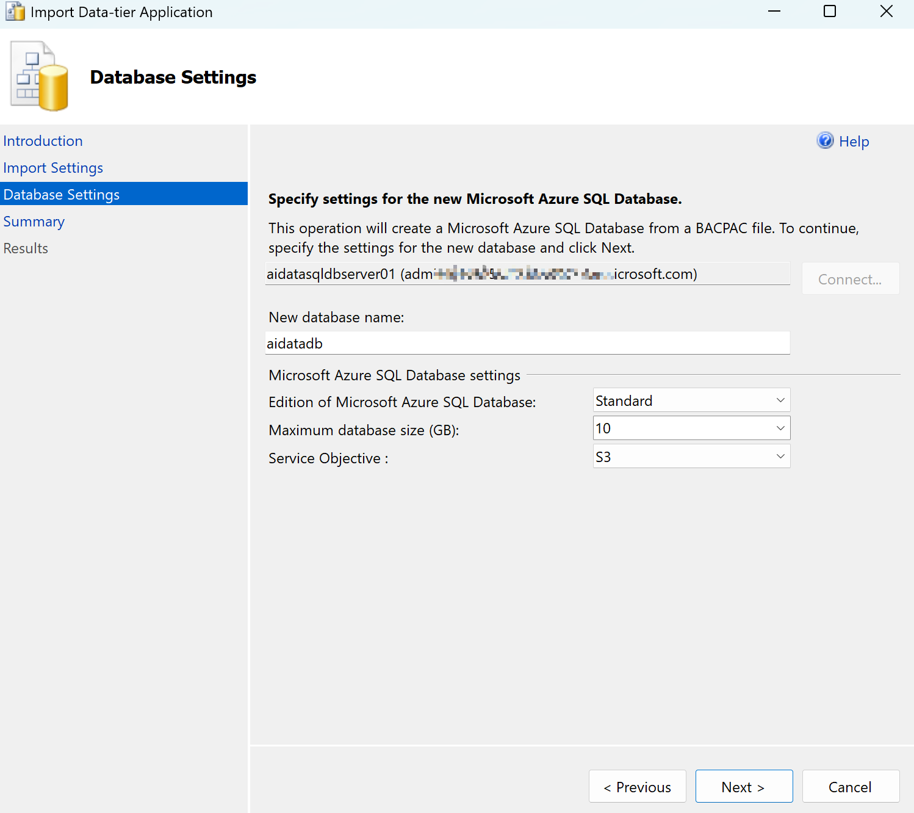


| 属性               | 値       |
| ------------------ | -------- |
| データベース名     | pdpv2db |
| サービスレベル     | Standard |
| DTU                | 100      |
| データの最大サイズ | 10GB     |

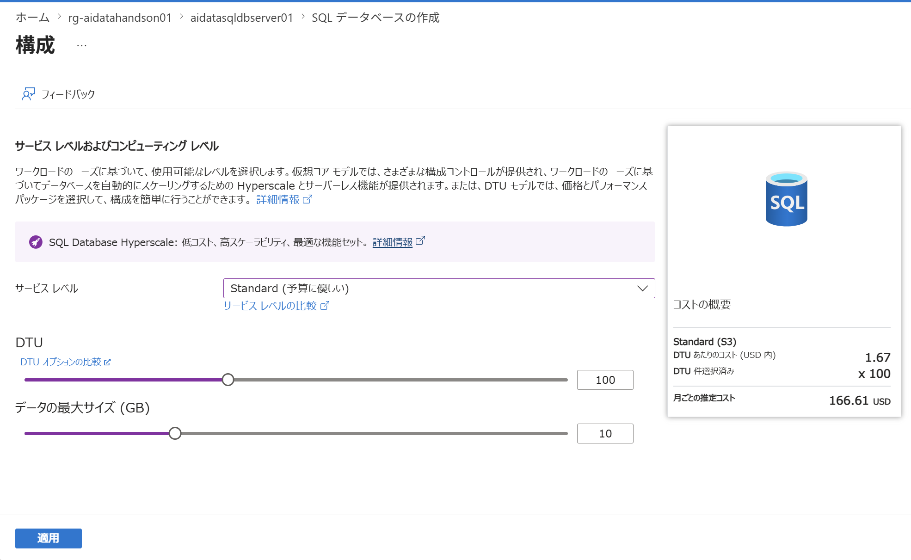

作業時間目安

S0 = DTU 10 : 40分～1時間
S1 = DTU 20 : 20 分～ 30 分
S2 = DTU 50 : 15 分～ 20 分
S3 = DTU 100 : 12 分 ～ 15 分

> ※ Azure ポータルから行うときのパラメータは上記を指定する。
> ※ 記載のないパラメータは既定値を使用する。
> ※ データベースのリストアは少し時間がかかるため、処理中も後続の作業を進める。
> ※ Azure ポータルでリストアを行っている場合は、後続の作業をブラウザの別タブで行う。

10.  ブラウザで新しいタブを開き、次の URL に接続し、Fabric ポータルを開く。

[https://app.fabric.microsoft.com/](https://app.fabric.microsoft.com/)

11. （当ハンズオンの環境を管理している、Fabric 管理者のみ実施）Fabric 管理画面を開き、次の設定を有効化する。

[サービス プリンシパルは Fabric の公開用 API を呼び出すことができます]

[ユーザーは、Fabric 外部のアプリを使用して OneLake に格納されているデータにアクセスできます]

[**ユーザーは Ontology (プレビュー) アイテムを作成できます**]

12.  Fabric ポータルにログインして、画面左下の [Power BI] をクリックし、[Fabric] に切り替える。
13.  [Fabric へようこそ] の画面で [新しいワークスペース] をクリックし、ワークスペースを作成する。


| 属性                 | 値                                                                              |
| -------------------- | ------------------------------------------------------------------------------- |
| 名前                 | pdpv2ws＜No＞                                                                  |
| ワークスペースの種類 | Fabric                                                                          |
| 詳細                 | 前章 [I.事前準備 1 Azure] で作成した Fabric 容量を選択（pdpv2fabricsku＜No＞） |

> ※ ＜＞内は自身の環境に応じて適宜書き換える。

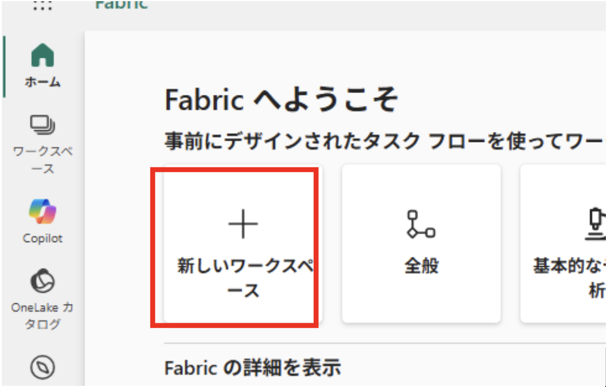

14. （当ハンズオンを同じワークスペースで行う共同作業者がいる場合）作成したワークスペースを開き、画面右上の [アクセスの管理] で権限を付与する。

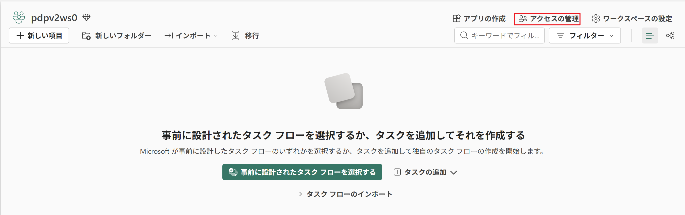
※ 当ハンズオンでは [メンバー] または [共同作成者] 権限を推奨する。

[Microsoft Fabric のワークスペースのロール - Microsoft Fabric | Microsoft Learn](https://learn.microsoft.com/ja-jp/fabric/fundamentals/roles-workspaces)

## Fabric にレイクハウスとウェアハウスを作成する

本手順は Fabric ポータルでレイクハウスとウェアハウスを作成し、ウェアハウスにファクトテーブルのデータをロードする手順となる。

本手順では次のファイルを使用する。

- `fabriccreatetbl.sql`

これらのファイルはコーチより受け取り、各自端末の任意のフォルダにコピーしておく。

1. ブラウザで新しいタブを開き、Fabric ポータルにログインして、各自指定されたワークスペースに移動する。
2. [＋新しい項目] をクリックし、次の内容で [レイクハウス] を作成する。

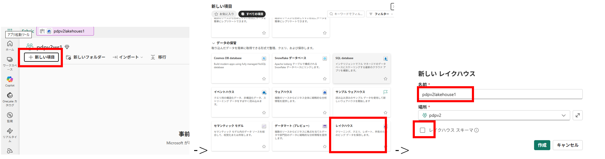

※ 新しい項目は、カテゴリで [データの保管] - [ウェアハウス] を指定する。


| 属性                 | 値                                           |
| -------------------- | -------------------------------------------- |
| 名前                 | pdpv2lakehouse＜No＞                        |
| 場所                 | 自身が作業を行っているワークスペース名を指定 |
| レイクハウススキーマ | チェックを外す                               |

3. [pdpv2lakehouse＜No＞] が自動で開くので、画面左側の [エクスプローラー] で、[Files]をクリックする。
4. [Files] の […] をクリックし、プルダウンメニューから[新しいショートカット]をクリックする。

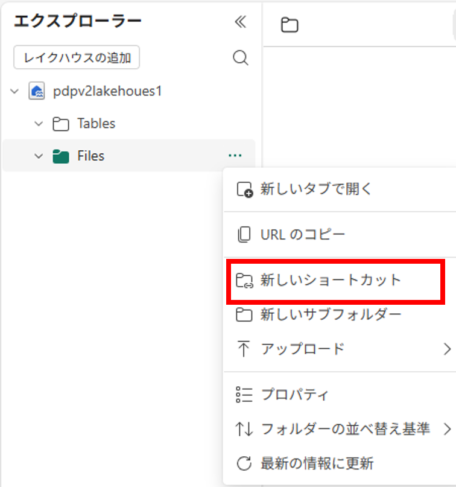

5. [新しいショートカット] で [外部リソース] の [Azure Blob ストレージ] をクリックする。
6. [新しい接続] にチェックを入れ、[接続設定]の画面で次の内容を入力する。


| 属性                   | 値                                                 |
| ---------------------- | -------------------------------------------------- |
| アカウント名または URL | https://pdpv2storage＜No＞.blob.core.windows.net/ |
| 接続名                 | pdpv2storage＜No＞                                |
| 認証の種類             | 組織アカウント                                     |

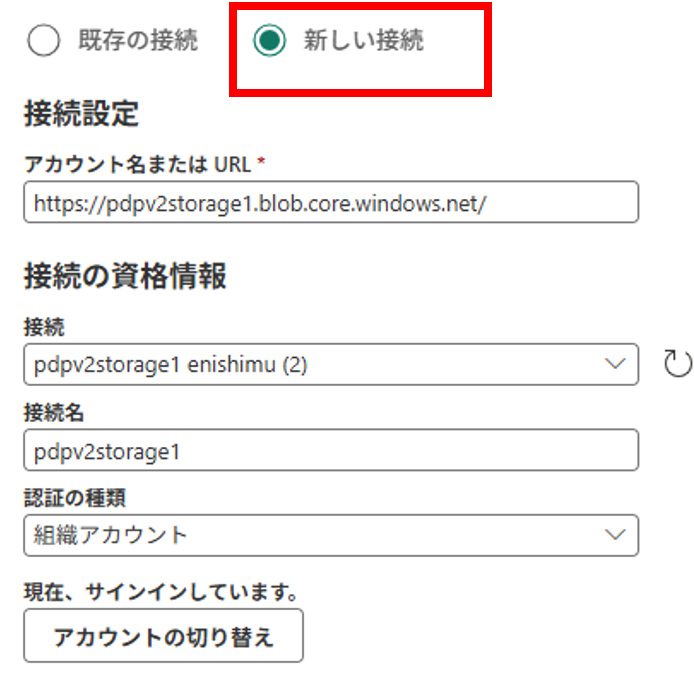

> ※ [認証の種類] で [組織アカウント] を選択し、 [サインイン] をクリックし、認証ダイアログが表示されたら、Azure への接続で使用するアカウントを選択して認証を完了させる。
> ※ 接続が正常に行われると、[接続] 欄に作成された接続が選択されているので次へ進む。
> ※ 接続でエラーが出る場合は、Azure 側で権限設定やネットワーク接続を確認する。

7. [新しいショートカット] でショートカットの元となる [salescontainer] にチェックを入れ、[次へ] をクリックする。
   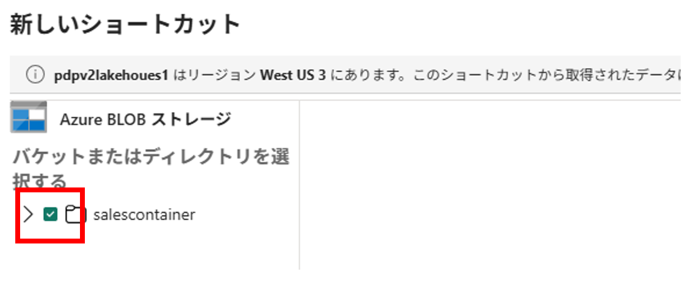
8. [変換] で [スキップ] をクリックする。
9. [新しいショートカット] で設定した内容を確認し、[作成] をクリックする。
10. [pdpv2lakehouse＜No＞] の [エクスプローラー] で [pdpv2lakehouse＜No＞] - [Files] - [salescontainer] を選択し、[fact\_sale.parquet], [pdpv2db.bacpac] ファイルが見えることを確認する。
    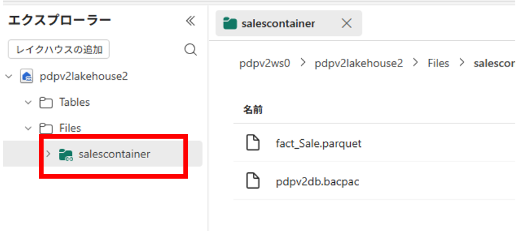
11. Fabric ポータル左のナビゲーションバーで [pdpv2ws＜No＞] のワークスペースをクリックする。
12. [＋新しい項目] をクリックし、次の内容で [ウェアハウス] を作成する。

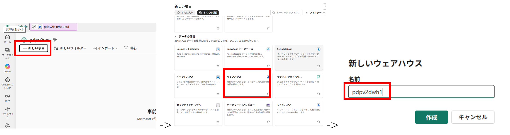

※ 新しい項目は、カテゴリで [データの保管] - [ウェアハウス] を指定する。


| 属性 | 値              |
| ---- | --------------- |
| 名前 | pdpv2dwh＜No＞ |

13. [pdpv2dwh＜No＞] が自動で開くので、画面上部のメニューから[新規 SQL クエリ]―＞[新規 SQL クエリ]をクリックする。

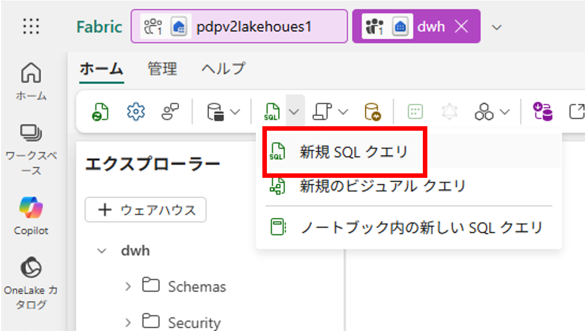

14. メモ帳などのテキストエディターでコーチから配布された [fabriccreatetbl.sql]ファイルを開き、内容をクエリエディタにコピー＆ペーストする。
15. クエリエディタ上部の [▷ 実行] をクリックし、全クエリを実行する。

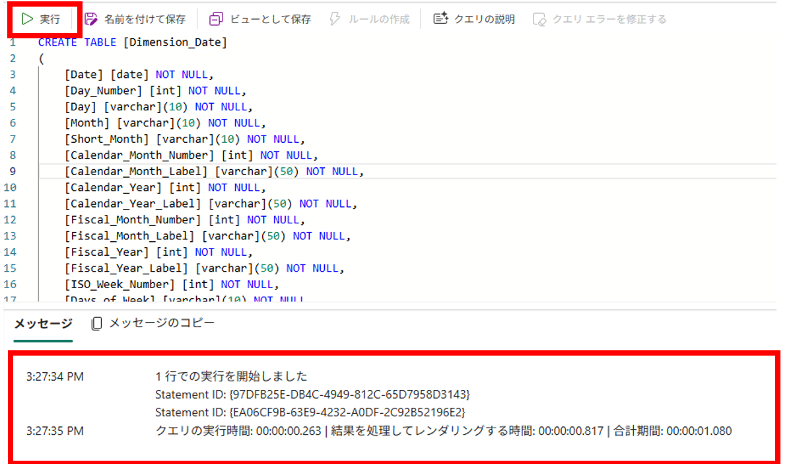

> ※ クエリの一部が選択された状態になっていないことを確認して実行する。一部が選択された状態だと、選択された部分のみ実行がかかり、エラーの原因となる。
> ※ 実行後、クエリエディタの下部にメッセージが表示されるのでエラーが出ていないことを確認する。

16. [エクスプローラー] で [pdpv2dwh＜No＞] - [Schemas] - [dbo] - [Tables]を展開して、[Fact\_Sale] テーブルが作成されていることを確認する。

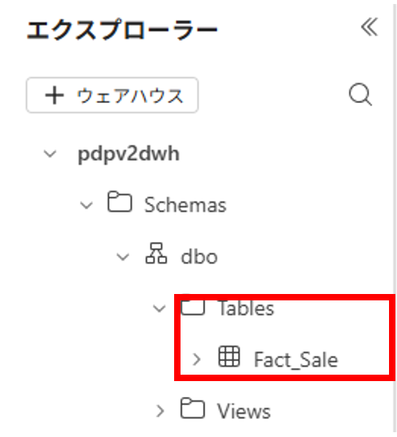

17. Fabric ポータル左のナビゲーションバーで [pdpv2dwh＜No＞] のワークスペースをクリックする。
18. [＋新しい項目] をクリックし、次の内容で [コピージョブ] を作成する。

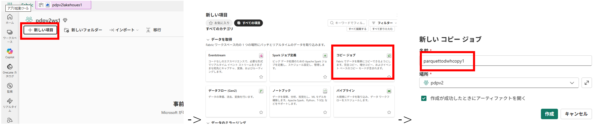

※ 新しい項目は、カテゴリで [データを取得] - [コピージョブ] を指定する。

| 属性                                       | 値                                           |
| ------------------------------------------ | -------------------------------------------- |
| 名前                                       | parquettodwhcopy＜No＞                       |
| 場所                                       | 自身が作業を行っているワークスペース名を指定 |
| 作成が成功したときにアーティファクトを開く | チェックが入ったままの状態                   |

19. コピージョブのウィザードを次の内容で進める。

    1. データソースの選択
       [pdpv2lakehouse＜No＞] を選択
       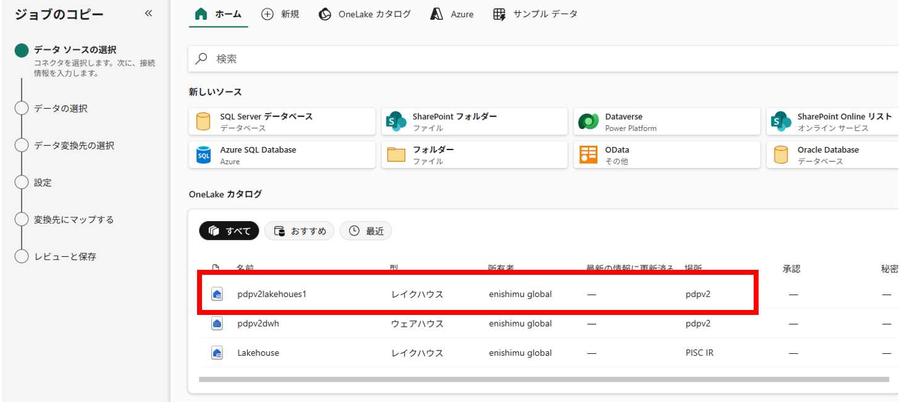
    2. データの選択
       [ファイル] をチェック -> [fact_sale.parquet] をチェック
       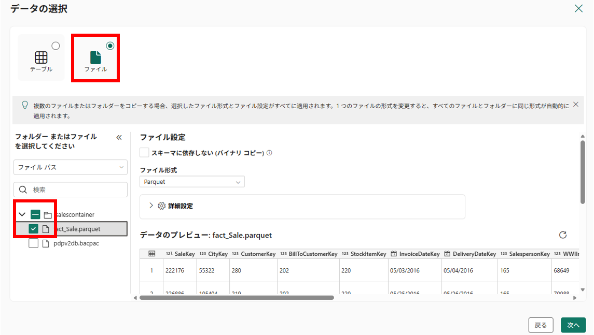
    3. データ変換先の選択
       [pdpv2dwh＜No＞] を選択
       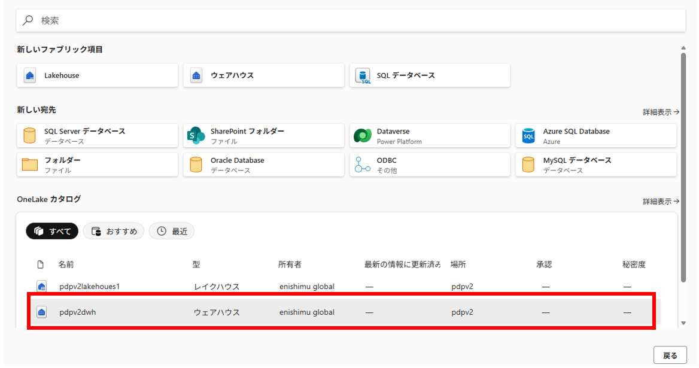
    4. 設定
       [完全なコピー] を選択
       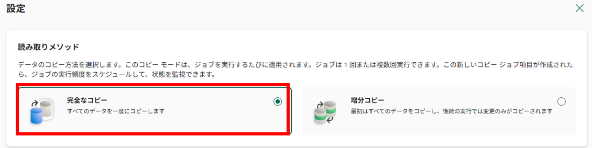
    5. 変換先にマップする
       [宛先] を [選択範囲] に変更し、[dbo.Fact\_Sale] を選択
       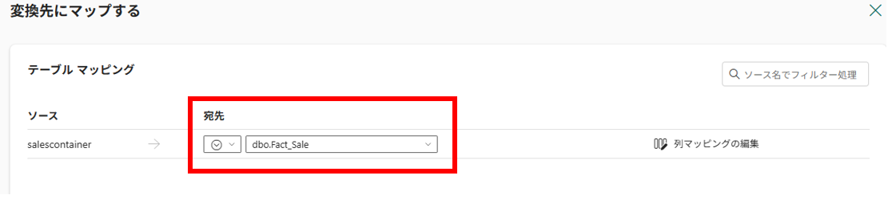
    6. レビューと保存
       [データ転送をすぐに開始する] と、[実行オプション] で [1 回実行する] にチェックが入っていることを確認し、[保存と実行] をクリック
       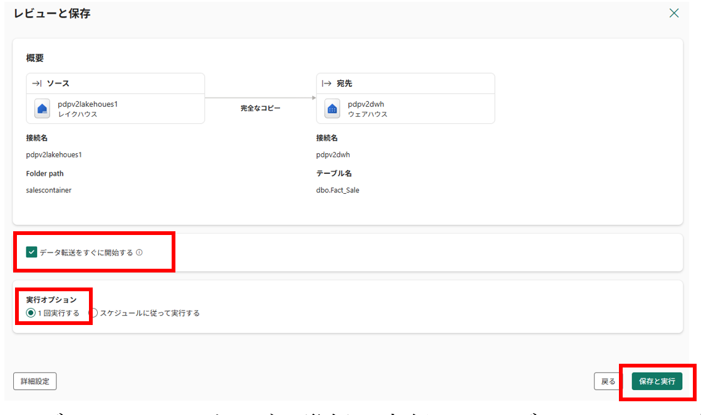

    > ※ データコピージョブが登録、実行され、データコピーが終了するまで数分かかる。
    > ※ データコピーが終了したときに、状態が [成功] となれば正常終了となる。
    > 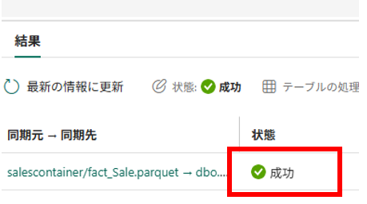
    >
20. [pdpv2dwh＜No＞] を開き、画面左のエクスプローラーで [Fact_Sale] テーブルをクリックするとデータのプレビューに取り込んだデータが表示されることを確認する。

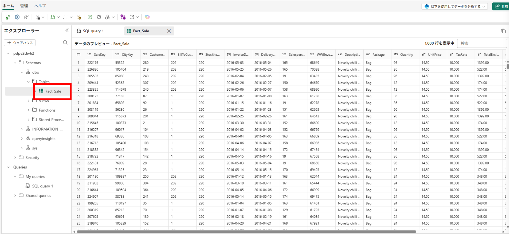

> ※ タブを閉じていた場合は、 Fabric ポータル左のナビゲーションバーからアイテムを再度開く。

## SQL Database のミラーリングを作成する

本手順は SQL Database のミラーリング設定を行い、パイプラインで SQL Database 上のストアドプロシージャを実行することで、データがミラーリングされて来ることを確認する。

1. Fabric ポータル左のナビゲーションバーで [pdpv2ws＜No＞] のワークスペースをクリックする。
2. [＋新しい項目] をクリックし、次の内容で [ミラー化された Azure SQL Database] を作成する。

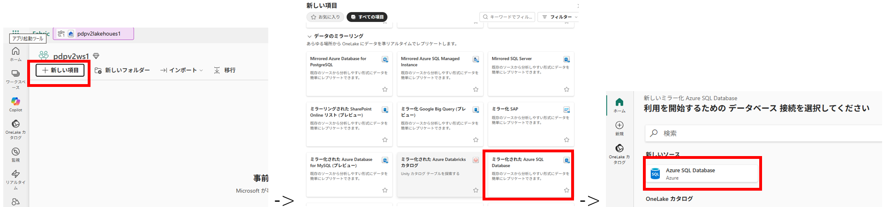

> ※ 新しい項目は、カテゴリで [データのミラーリング] - [ミラー化された Azure SQL Database] を指定する。
> ※ [新しいミラー化 Azure SQL Database] の作成ウィザードを次の内容で進める

1. 新しいソース


| 属性         | 値                                           |
| ------------ | -------------------------------------------- |
| サーバー     | pdpv2sqldbserver＜No＞.database.windows.net |
| データベース | pdpv2db                                     |
| 接続名       | pdpv2sqldbserver＜No＞;pdpv2db             |
| 認証の種類   | 組織アカウント                               |

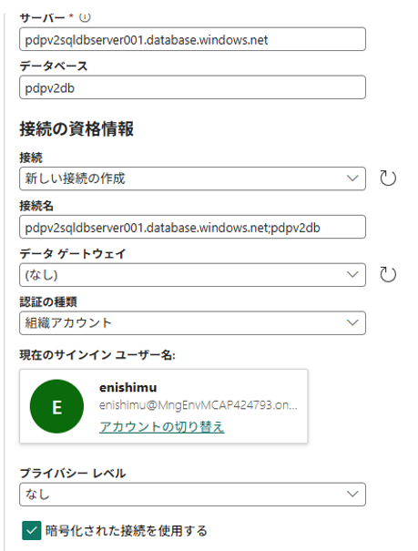

> ※ 記載のないパラメータは既定値を使用する。
> ※ [認証の種類] で [組織アカウント] を選択し、 [サインイン] をクリックし、認証ダイアログが表示されたら、Azure への接続で使用するアカウントを選択して認証を完了させる。
> ※ 接続でエラーが出る場合は、Azure 側で権限設定やネットワーク接続を確認する。

2. データの選択

- Integration.City\_Staging
- Integration.Customer\_Staging
- Integration.Employee\_Staging
- Integration.StockItem\_Staging

> ※ すべてのテーブルのチェックを外し、次の 4 つのテーブルのみチェックを入れる。
> 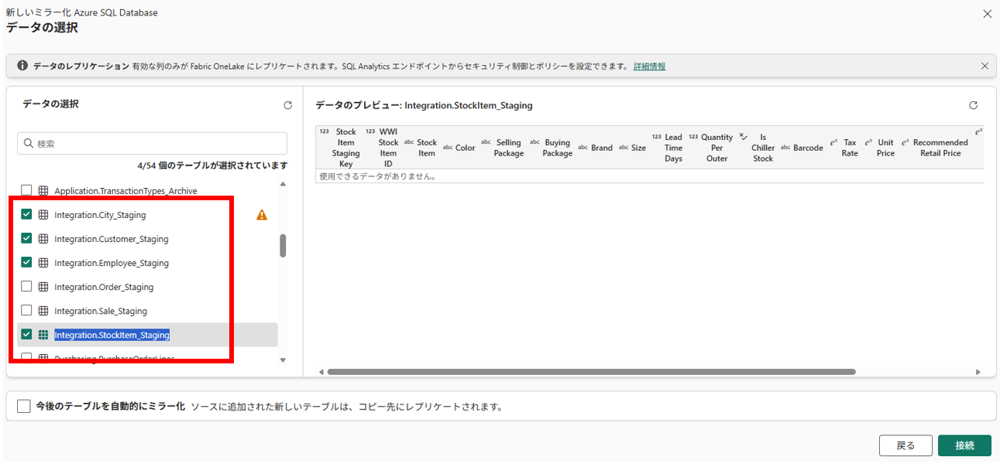

3. 宛先
   `pdpv2db`

> ※ 名前が誤っていないことを確認し、[ミラー化されたデータベースを作成する] をクリックする。
> 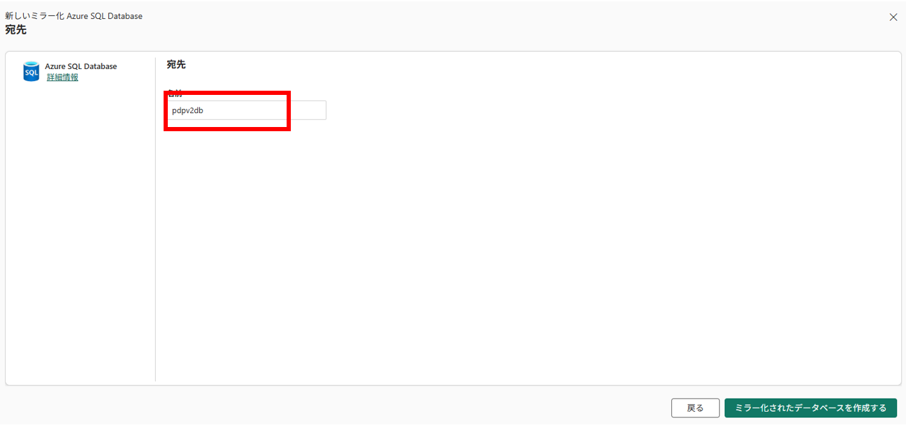

3. [pdpv2db] が自動で開くので、画面中央の [レプリケーションの監視] で [最新の情報に更新] をクリックして 4 つのすべてのテーブルの状態が [実行中] となっていることを確認する。
   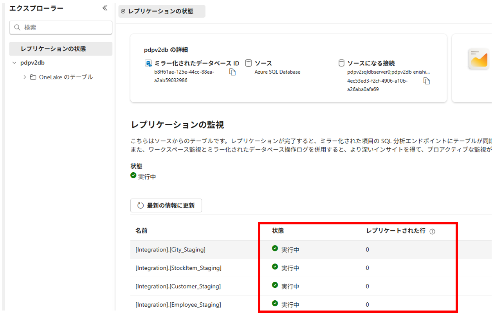

> ※ 当該テーブルにはまだデータが入っていないため、[レプリケートされた行] は、[0] となっている。
> ※ この段階では、いずれのテーブルにもデータがまだレプリケートされていないため、[エクスプローラー] でテーブルをクリックしてもデータは表示されない。

4. Fabric ポータル左のナビゲーションバーで [pdpv2ws＜No＞] のワークスペースをクリックする。
5. [＋新しい項目] をクリックし、次の内容で [パイプライン] を作成する。

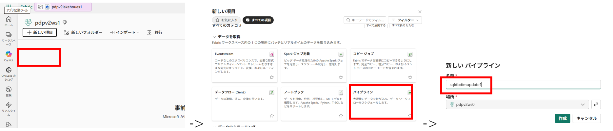

> ※ 新しい項目は、カテゴリで [データを取得] - [パイプライン] を指定する。


| 属性 | 値                   |
| ---- | -------------------- |
| 名前 | sqldbdimupdate＜No＞ |
| 場所 | pdpv2ws＜No＞       |

6. [sqldbdimupdate＜No＞] が自動で開くので、メニューの [アクティビティ] を開き、[スクリプト] をクリックする。

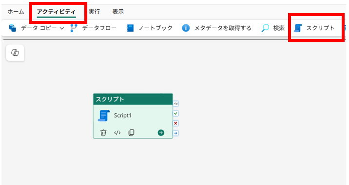

7. [Script1]アクティビティを選択し、画面下に表示される設定内容で [設定] をクリックする。

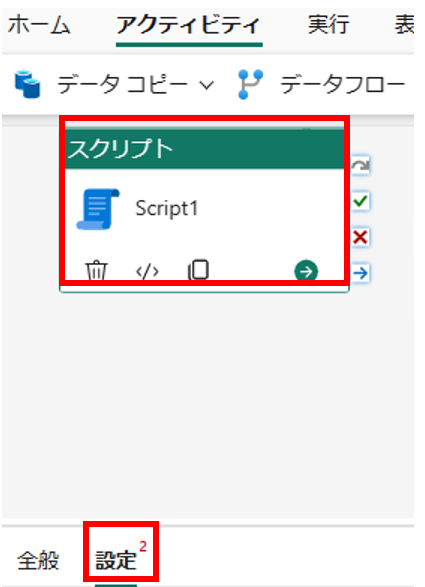

8. [設定] を次の内容で設定する。


| 属性                   | 値                                                      |
| ---------------------- | ------------------------------------------------------- |
| 接続                   | pdpv2sqldbserver＜No＞;pdpv2db                        |
| データベース           | pdpv2db                                                |
| スクリプト             | NonQuery を選択。枠内は後続の内容をコピー＆ペーストする |
| スクリプトのパラメータ | [新規] を 2 回クリックし、次のパラメータを追加する      |


|       |                     |          |                               |                 |       |
| ----- | ------------------- | -------- | ----------------------------- | --------------- | ----- |
| Index | 名前                | 種類     | 値                            | null として扱う | 方向  |
| 1     | TargetETLCutoffTime | Datetime | @formatDateTime('2016-05-31') | □              | Input |
| 2     | LastETLCutoffTime   | Datetime | @formatDateTime('2010-01-01') | □              | Input |

```sql
DELETE FROM [Integration].[City_Staging];
DELETE FROM [Integration].[Customer_Staging];
DELETE FROM [Integration].[Employee_Staging];
DELETE FROM [Integration].[StockItem_Staging];
INSERT INTO [Integration].[City_Staging] EXEC Integration.GetCityUpdates @LastETLCutoffTime, @TargetETLCutoffTime;
INSERT INTO [Integration].[Customer_Staging] EXEC Integration.GetCustomerUpdates @LastETLCutoffTime, @TargetETLCutoffTime;
INSERT INTO [Integration].[Employee_Staging] EXEC Integration.GetEmployeeUpdates @LastETLCutoffTime, @TargetETLCutoffTime;
INSERT INTO [Integration].[StockItem_Staging] EXEC Integration.GetStockItemUpdates @LastETLCutoffTime, @TargetETLCutoffTime;
```

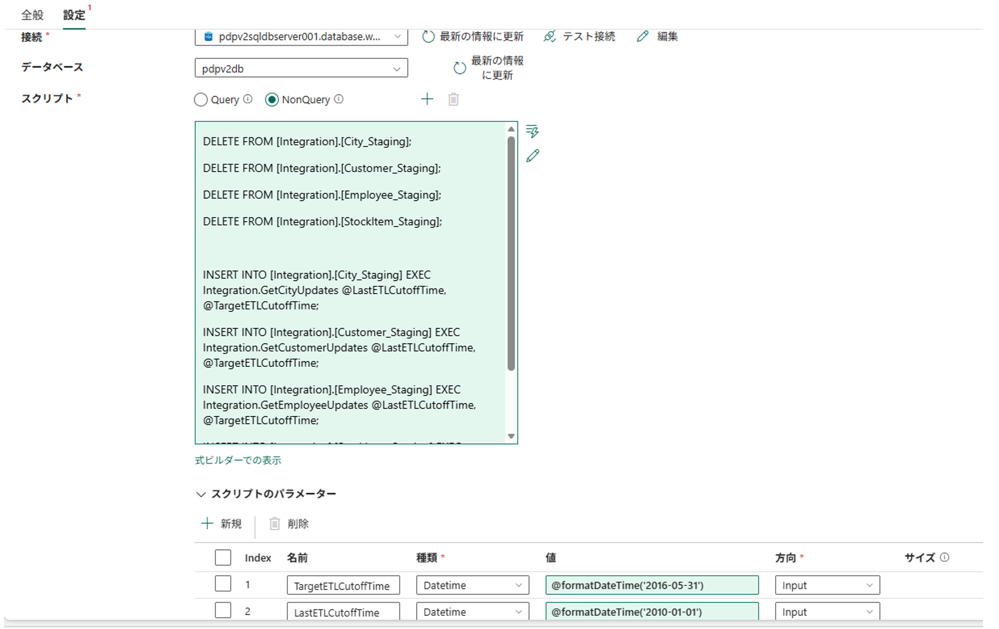

9. [ホーム] を開き、[保存] を追加した後、[実行] をクリックする。

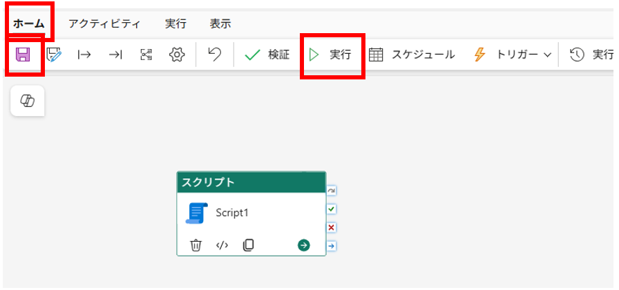

10. 画面中央下部の [出力] 結果で [成功] が表示されることを確認する。

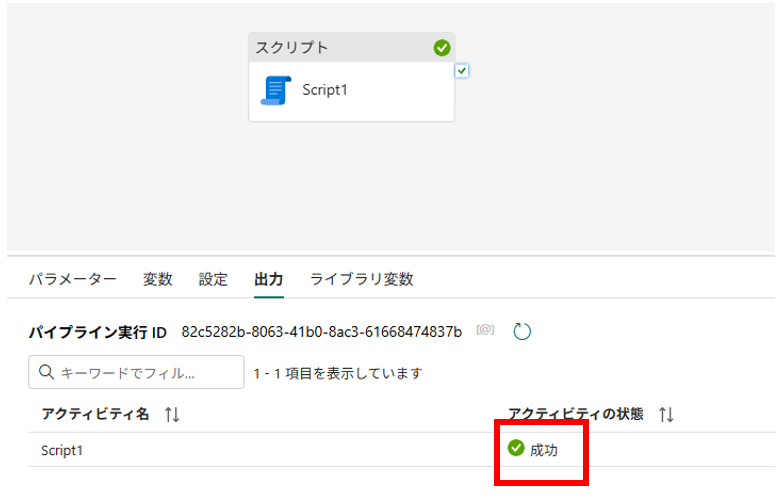

11. [pdpv2db] を開き、画面中央の [レプリケーションの監視] で [最新の情報に更新] をクリックして 4 つのテーブルの [レプリケートされた行] が次のとおりとなっていることを確認する。


| Table                              | Count  |
| ---------------------------------- | ------ |
| [Integration].[StockItem\_Staging] | 227    |
| [Integration].[City\_Staging]      | 116294 |
| [Integration].[Employee\_Staging]  | 174    |
| [Integration].[Customer\_Staging]  | 402    |

> ※ 順不同、件数が異なる場合は、再度更新をかけてみる。
> ※ [エクスプローラー] を展開し、各テーブルをクリックすると、画面中央にデータのプレビューが表示される。
> ※ [City\_Staging] の例

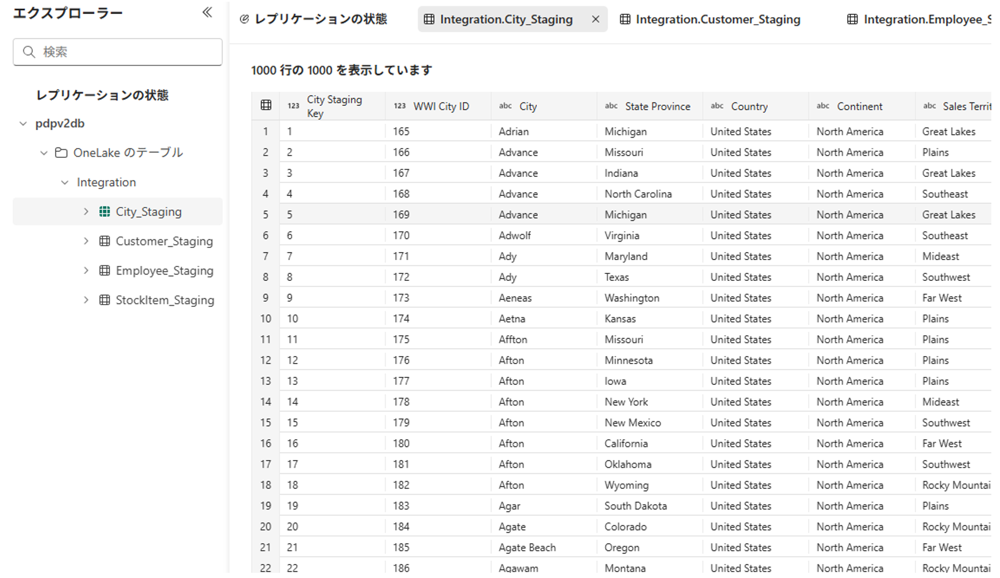

## Event Hubs からリアルタイムデータを取り入れる

本手順は、Event Hubs からリアルタイムデータを取り込むイベントストリームを作成しイベントハウスにデータを挿入する。また、レイクハウスに KQL テーブルのショートカットを作成することで、セマンティックモデルで使用できるようにする。

本手順では次のファイルを使用する。

- [calendar\_2013.json]
- [calendar\_2014.json]
- [calendar\_2015.json]
- [calendar\_2016.json]

これらのファイルはコーチより受け取り、各自端末の任意のフォルダにコピーしておく。

1. Fabric ポータル左のナビゲーションバーで [pdpv2ws＜No＞] のワークスペースをクリックする。
2. [＋新しい項目] をクリックし、次の内容で [イベントハウス] を作成する。

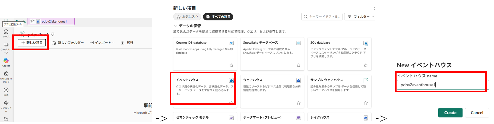

> ※ 新しい項目は、カテゴリで [データの保管] - [イベントハウス] を指定する。

名前　：　pdpv2eventhouse＜No＞

> ※ イベントハウスを作成する時は下記メッセージが表示されるが、イベントハウスの簡単な説明であるためそのまま [Get Started] をクリックする。

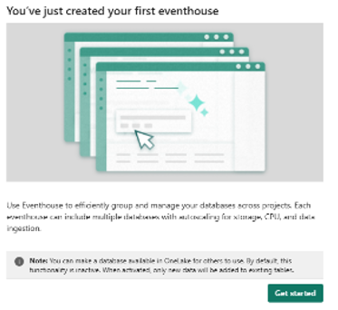

> ※ アイテムを作成したときにポップアップで操作手順が表示されることがあるが、気にせず本書の手順に沿った作業を進める。

3. [pdpv2eventhouse＜No＞] が自動で開くので、画面左側の [KQL データベース] で [pdpv2eventhouse＜No＞] をクリックする

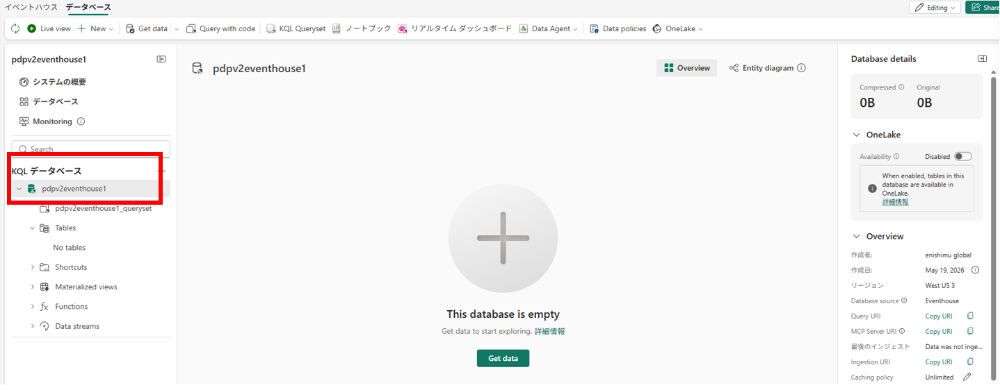

4. 画面右側に [データベースの詳細] が表示されるので [OneLake] の [Availability] をオンに変更する。

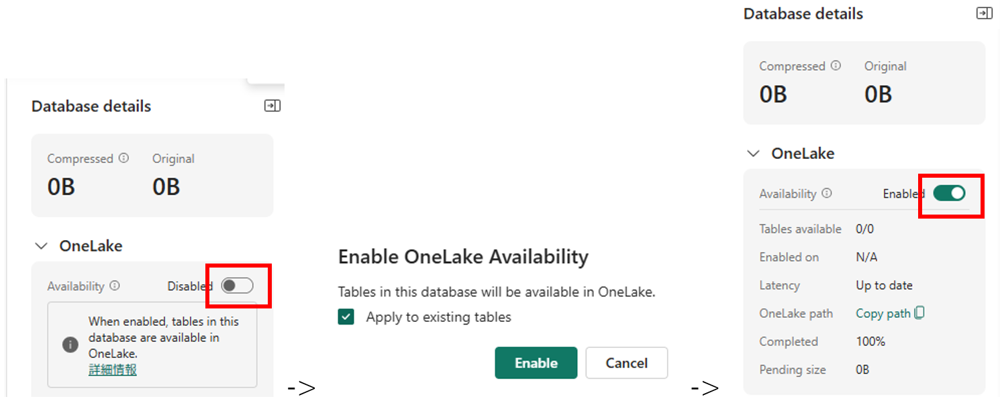

> ※ [Enable OneLake availability] が表示されるので [Apply to existing tables] にチェックが入っていることを確認し、 [Enable] をクリックする。
> ※ 1, 2 分して [Availability] がオンになることを確認する。
> ※ この段階では、まだテーブルを作成しておらず、データも取り込んでいないため、対象テーブル、サイズ共に [0B] となっている。

5. Fabric ポータル左のナビゲーションバーで [pdpv2ws＜No＞] のワークスペースをクリックする。
6. [＋新しい項目] をクリックし、次の内容で [Eventstream] を作成する。

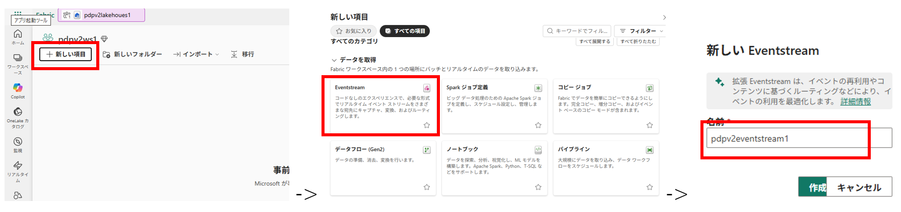

> ※ 新しい項目は、カテゴリで [データを取得] - [Eventstream] を指定する。

名前　：　pdpv2eventstream＜No＞

7. [pdpv2eventstream＜No＞] が自動で開くので、画面中央の [データソースの接続] をクリックする。

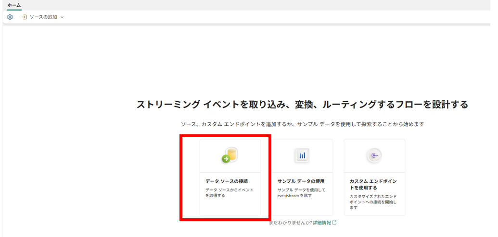

8. [データソースの選択] で [Azure Event Hubs] の右上にある [接続] をクリックする。

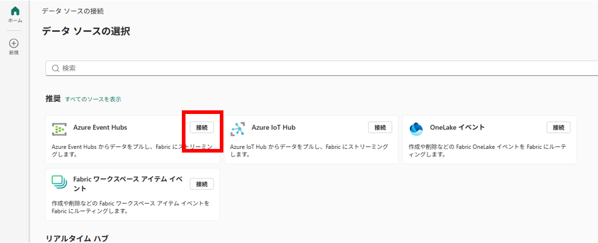

9. データソースの接続のウィザードを次の内容で進める。

   1. 接続設定の構成
      [接続] で [新しい接続] のリンクをクリックする。
      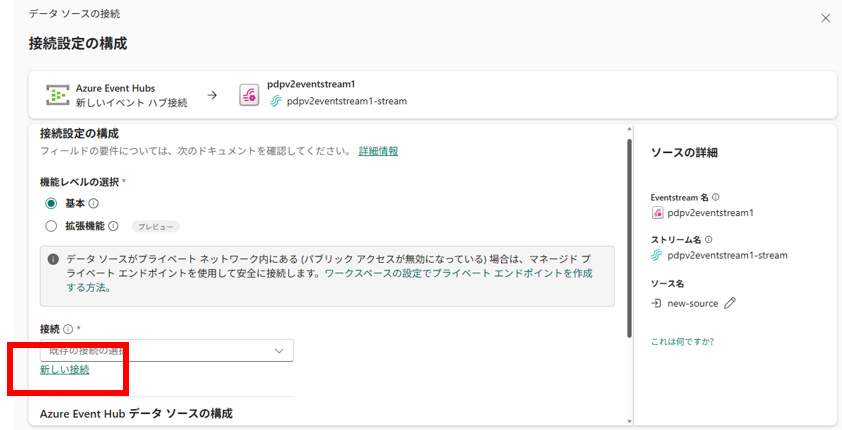
   2. 接続設定

   次の内容で接続を作成する。

   | 属性                   | 値                                                |
   | ---------------------- | ------------------------------------------------- |
   | イベントハブの名前空間 | pdpv2eventhubnamespace＜No＞                     |
   | イベントハブ           | pdpv2eventhubname＜No＞                          |
   | 接続名                 | pdpv2eventhubconnecter＜No＞                     |
   | 認証の種類             | 基本                                              |
   | ユーザー名             | ＜Event Hubs の共有アクセスポリシーのポリシー名＞ |
   | パスワード             | ＜Event Hubs の共有アクセスポリシーの主キー＞     |

   > ※ 記載のないパラメータは既定値を使用する。
   > ※ 当ハンズオンはイベントハブの名前空間の SAS キーを使用しているが、実際のプロジェクトにおいては、セキュリティを考慮し、イベントハブ毎の SAS キーを作成することを推奨する。
   > ※ ユーザー名とパスワードは、Azure ポータルで Event Hubs を開き、内容を確認する。
   >

   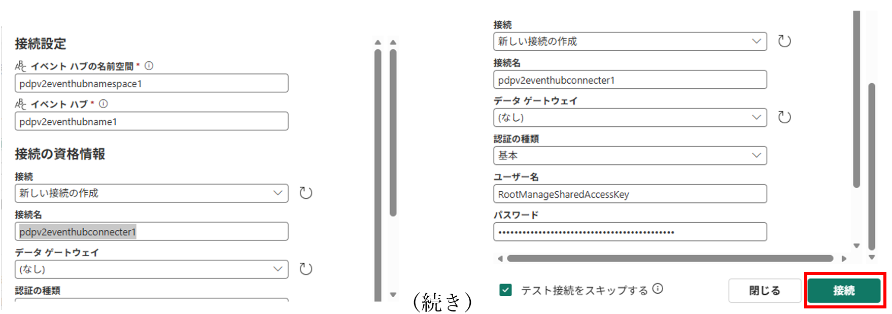

   > ※ 接続を作成すると [接続設定の構成] 画面に戻るので、[次へ] をクリック
   >

   3. スキーマ処理
      自動でスキップされる。
   4. 確認及び接続
      [追加] をクリック
10. [pdpv2eventstream＜No＞] に戻るので、画面下部の [作成エラー] を開き、エラーが出ていないことを確認する。

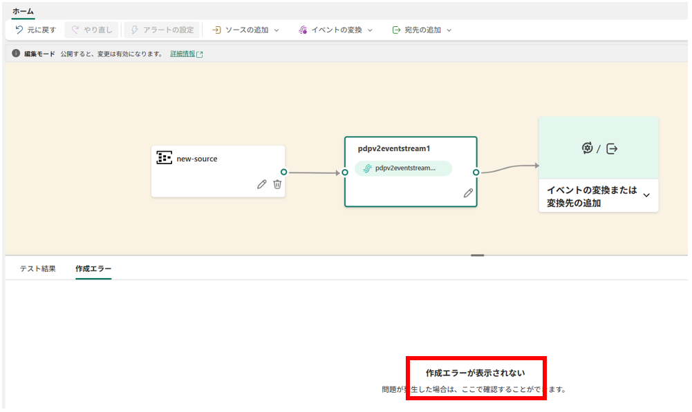

11. ブラウザで新しいタブを開き、Azure ポータルにログインする。
12. [pdpv2eventhubnamespace＜No＞] を開き、[エンティティ] - [Event Hubs] - [pdpv2eventhubname＜No＞] のリンクをクリックする。
13. [pdpv2eventhubname＜No＞] の [Data Explorer] を開き、[イベントの送信] をクリックする。

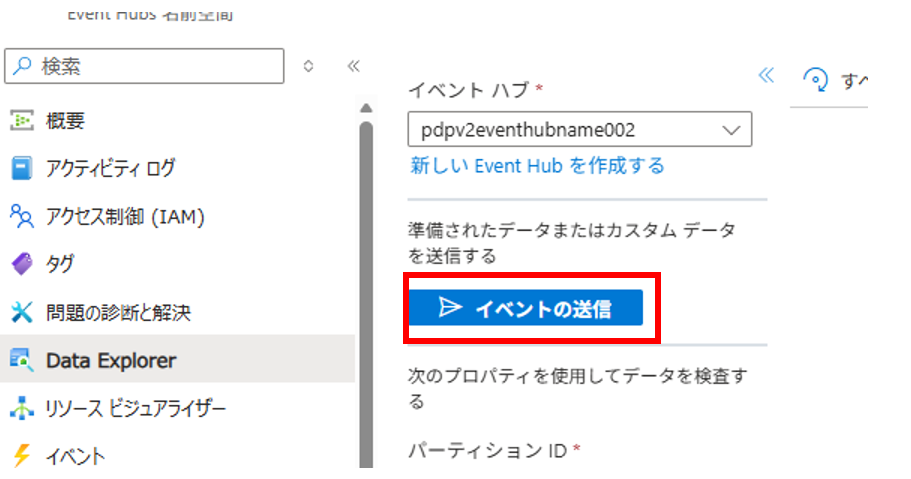

14.  画面右に表示される [イベントの送信] で [.json ファイルをアップロード] 横にある [参照] をクリックして、コーチから配布された [calendar_2013.json] ファイルをアップロードし、[送信] をクリックする。

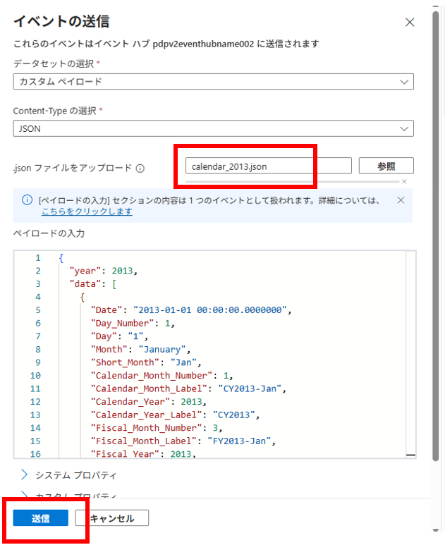

15. Azure ポータル右上の [通知] をクリックし、[イベントの送信完了] が通知されることを確認する。

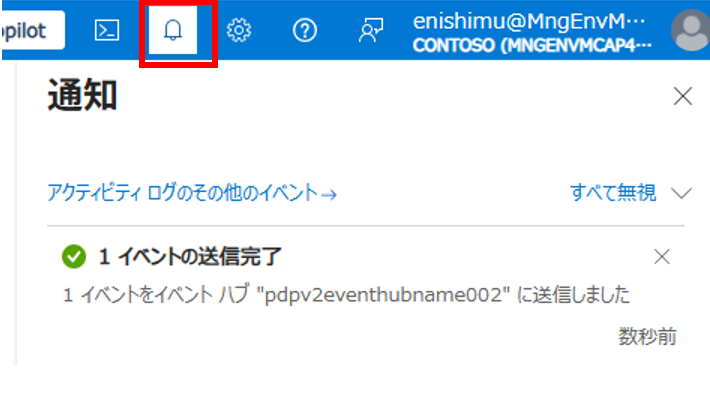

16. ブラウザで、Fabric ポータルで [pdpv2eventstream＜No＞] に戻り、[データプレビュー] をクリックし、[最新の情報] をクリックする。

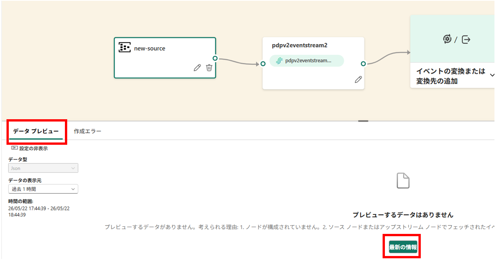

> ※ ブラウザのタブを切り替えた段階ではまだデータを受け取った情報に更新されていないため、画面下部では [プレビューするデータはありません] と表示されている。
> ※ [最新の情報] をクリックした後、問題が無ければ、送信されてきたデータのプレビューが表示される。

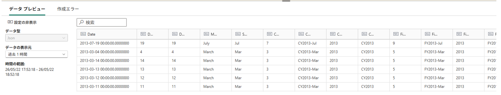

17. 画面中央で [イベントの変換または変換先の追加] をクリックすると表示されるプルダウンメニューで [フィールドの管理] をクリックする。

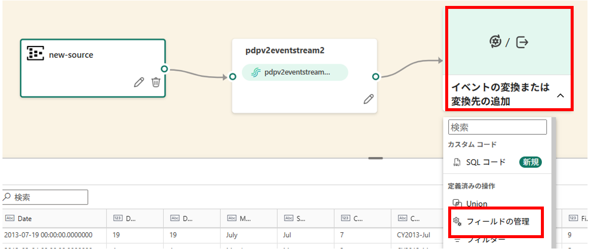

18. 表示が [ManageFields] に代わるので、鉛筆マークをクリックする。

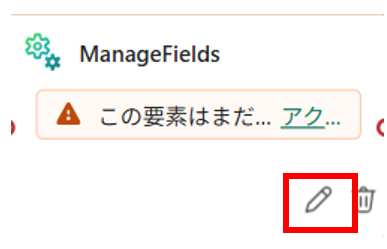

19. 画面右に表示される [フィールドの管理] で [フィールドの追加] をクリックする。

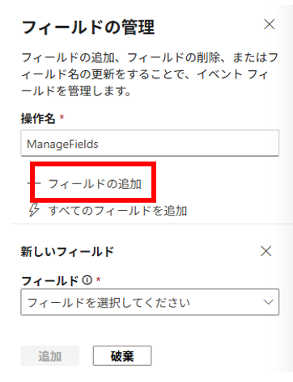

20. [フィールド] を開き、次の内容にチェックを入れ、[追加] をクリックする。

```
"Date", "Day_Number", "Day", "Month", "Short_Month", "Calendar_Month_Number", "Calendar_Month_Label",

"Calendar_Year", "Calendar_Year_Label", "Fiscal_Month_Number", "Fiscal_Month_Label", "Fiscal_Year",

"Fiscal_Year_Label", "ISO_Week_Number", "Days_of_Week", "Holiday", "Holiday_Name"
```

> ※ 全 17 項目で、[EventProcessedUtcTime], [PartitionId], [EventEnqueuedUtcTime] の 3 項目以外すべての項目にチェックを入れる。

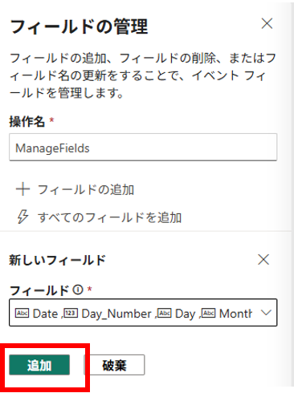

21. [Date] 項目をクリックし、[変更の種類] を [いいえ] から [はい] に変更し、[変換された型] で [DateTime] を指定する。

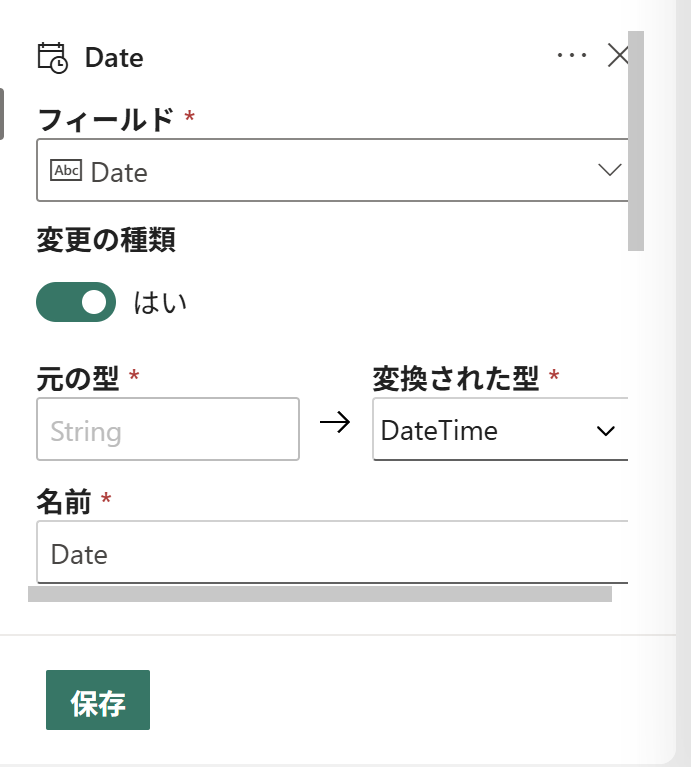

22. 追加した項目に誤りがないことを確認して、[保存] をクリックする。

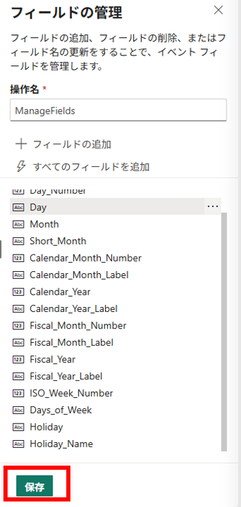

23. [ManageFields] の右側にマウスポインタを近づけると現れる [+] ボタンをクリックして表示されるプルダウンメニューから [イベントハウス] をクリックする。

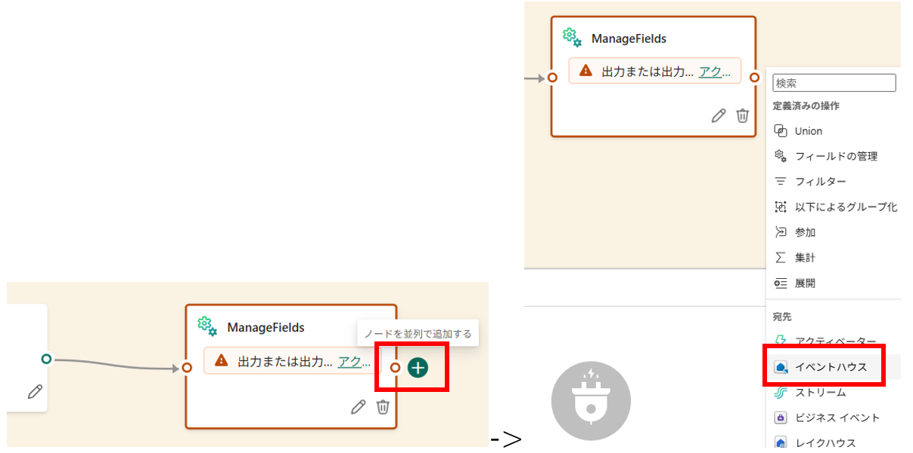

24. [Eventhouse] が追加されるので、鉛筆マークをクリックする。

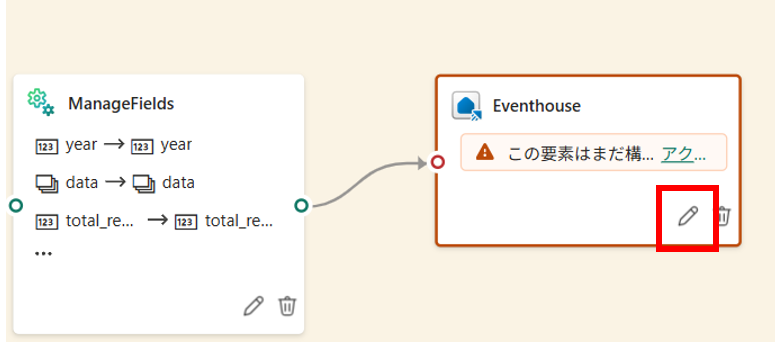

25. 画面右に表示される [Eventhouse] で次の内容を設定し、[保存] をクリックする。


| 属性               | 値                                                     |
| ------------------ | ------------------------------------------------------ |
| ワークスペース名   | pdpv2ws＜No＞                                         |
| イベントハウス     | pdpv2eventhouse＜No＞                                 |
| KQL データベース   | pdpv2eventhouse＜No＞                                 |
| KQL 変換先テーブル | [新規作成] のリンクをクリックして、[calendar] 名で作成 |

> ※ 記載のないパラメータは既定値を使用する。

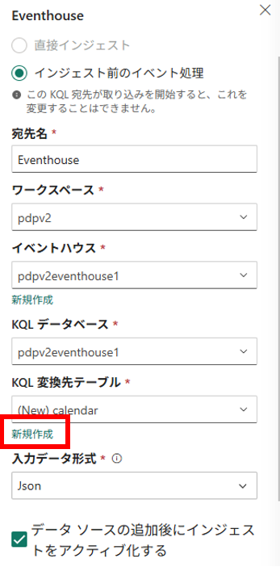

26. [pdpv2eventstream＜No＞] の画面右上にある [発行] をクリックする。

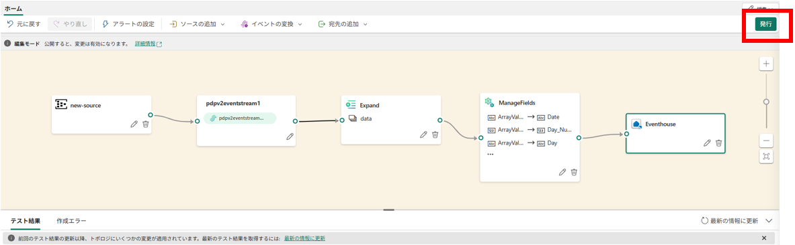

> ※ 正常に公開されるまで 5 分程度かかる。

27. ブラウザ で、Azure ポータルの Event Hubs を開いていたタブに切り替え、本章、手順 13 - 15 を再度実行し、Event Hubs に次の 4 つのファイルを再送信する。

- calendar_2013.json
- calendar_2014.json
- calendar_2015.json
- calendar_2016.json

※ 各ファイルは 1 回ずつ送信する。

※ 重複して送信すると、セマンティックモデル作成時にデータ不整合でエラーが生じるため注意する。

28. ブラウザで、Fabric ポータルに戻り [pdpv2eventstream＜No＞] の画面下部に表示されている [最新の情報] をクリックして、画面下部にデータがプレビューされることを確認する。

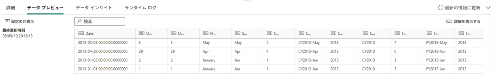

29. [pdpv2eventhouse＜No＞] を開き、画面左の [KQL データベース] - [pdpv2eventhouse＜No＞] - [Tables] - [calendar] を選択し、テーブルが作成され、データが挿入されていることを確認する。

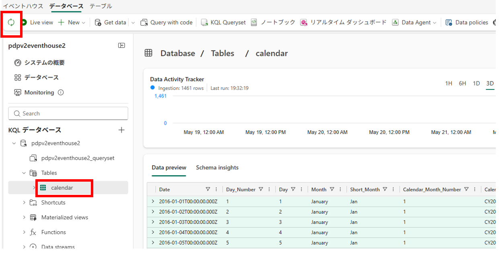

> ※ [KQL データベース] - [pdpv2eventhouse＜No＞] をクリックすると、自動でブラウザの新しいタブが開き、[データベース] といったタブが追加された画面が表示される。
> ※ [calendar] の内容が表示されない場合は、メニューにある更新ボタンをクリックする。

30. [KQL データベース] - [pdpv2eventhouse＜No＞] - [pdpv2eventhouse＜No＞\_queryset] を選択し、記載内容をすべて消し、次の内容に変更した上で、それぞれ実行する。

```
calendar
| count

.alter-merge table calendar policy mirroring dataformat=parquet with (IsEnabled=true, TargetLatencyInMinutes=5);
```

> ※ コマンドは前 2 行と後ろ 1 行をそれぞれ選択し、2 度に分けて実行する。
> ※ 前 2 行を選択して実行すると、結果が [1461] として返ってくる。
> 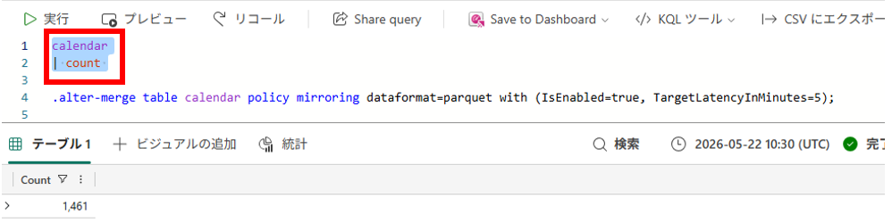

> ※ 後ろ 1 行を選択して実行すると、次の内容が返ってくる。
> 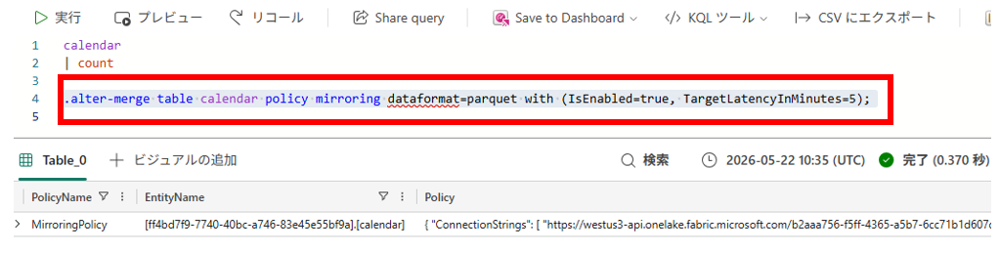

31. [pdpv2eventhouse＜No＞] を開き、エクスプローラーで [pdpv2eventhouse＜No＞] - [Tables] の […] をクリックし、プルダウンメニューから [新しいショートカット] をクリックする。

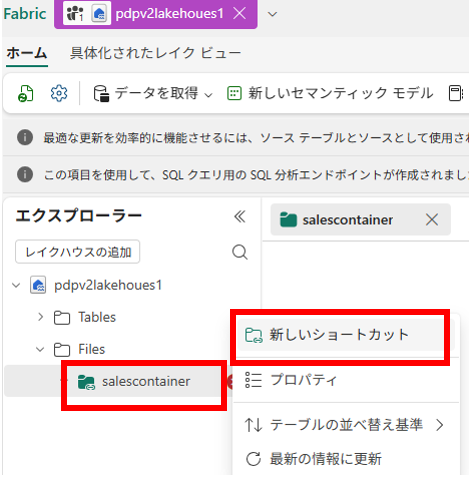

32. [新しいショートカット] で [Microsoft OneLake] をクリックする。

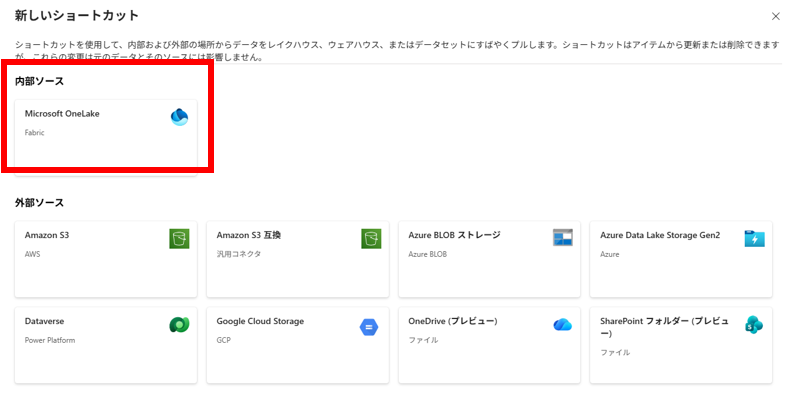

33. [データソースの種類を選択] で、[pdpv2eventhouse＜No＞] を選択し、[次へ] をクリックする。

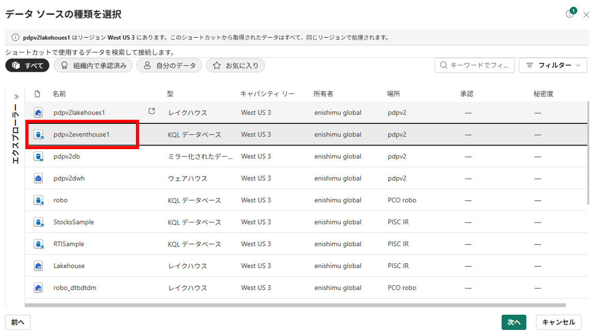

34. [新しいショートカット] で [pdpv2eventhouse＜No＞] - [Tables] - [calendar] にチェックを入れ、[次へ] をクリックする。

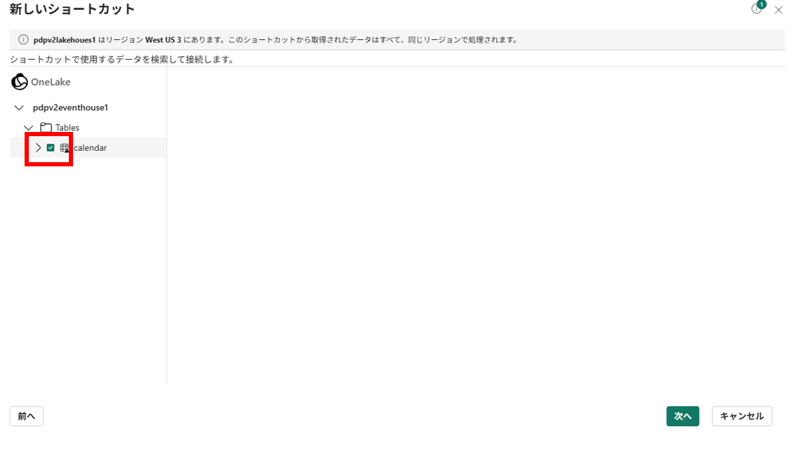

35. 内容を確認して、[作成] をクリックする。

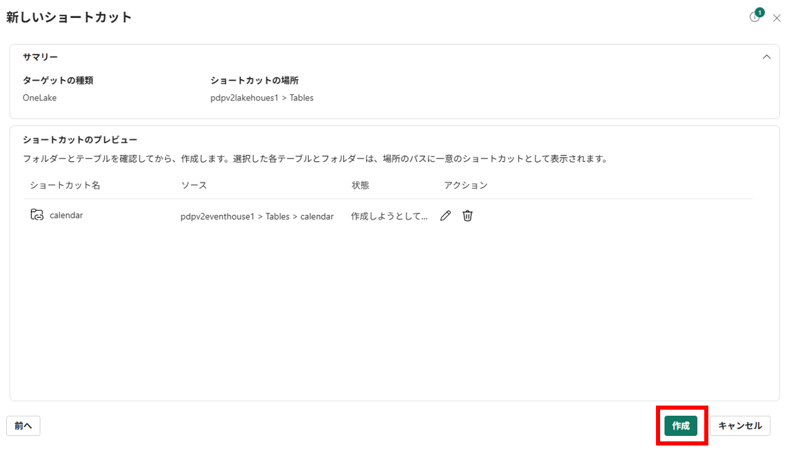

36. エクスプローラーで [pdpv2lakehouse＜No＞] - [Tables] 配下に [calendar] テーブルのショートカットが作成されており、データが参照できることを確認する。

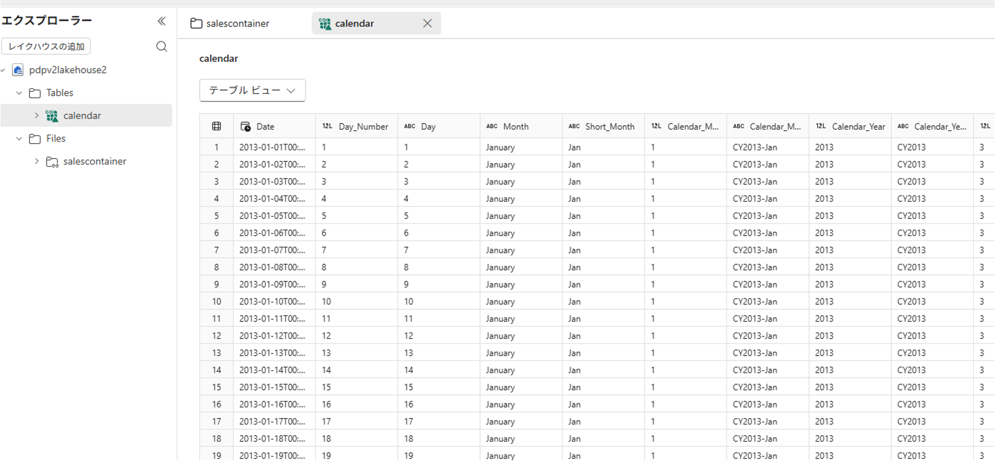

## セマンティックモデルを元にデータエージェントを作成する

本手順は、レイクハウスとウェアハウスに集めたデータを元にセマンティックモデルを作成し、Power BI やデータエージェントで利用できるようにする。また、セマンティックモデルを元にデータエージェントを作成し、Microsoft Foundry で利用できるようにする。

なお、本手順は Power BI Pro ライセンスが必要となる点に注意する。

1. Fabric ポータル左のナビゲーションバーで [pdpv2ws＜No＞] のワークスペースをクリックする。
2. [＋新しい項目] をクリックし、次の内容で [セマンティックモデル] を作成する。

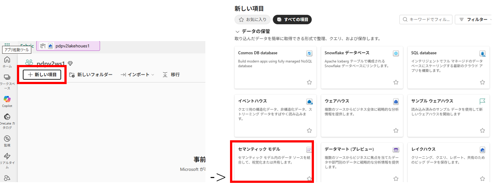

> ※ 新しい項目は、カテゴリで [データの保管] - [セマンティックモデル] を指定する。

3. [最初のレポートを作成する] が表示されるので、[OneLake カタログ] をクリックする。

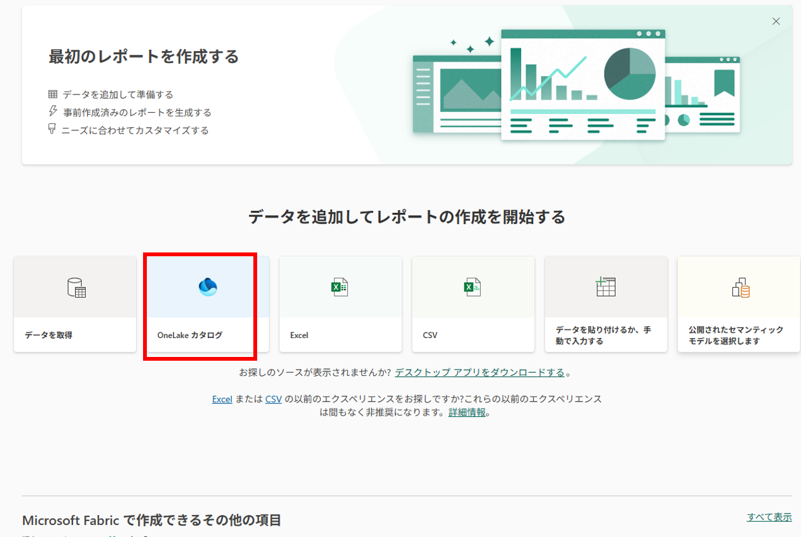

4. [pdpv2lakehouse＜No＞] を選択し、[接続] をクリックする。

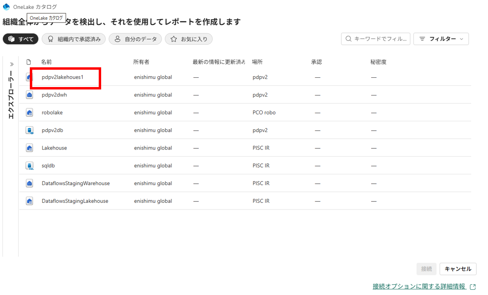

5. [OneLake からテーブルを選択] が表示されるので次の内容を入力し、[確認] をクリックする。


| 属性                                                        | 値                              |
| ----------------------------------------------------------- | ------------------------------- |
| Direct Lake セマンティック モデル名                         | pdpv2semantic＜No＞            |
| ワークスペース                                              | pdpv2ws＜No＞                  |
| セマンティック モデルのテーブルを選択または選択解除します。 | [calendar] にチェックを入れる。 |

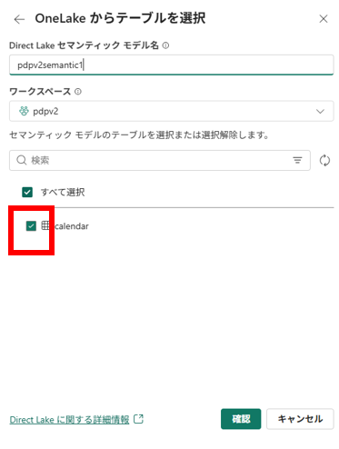

> ※ 対象のテーブルが出てこないときは、[検索] の右横にある更新ボタン（（図は原文参照））をクリックする。

6. セマンティックモデルの [モデルビュー] が表示されるので、[ホーム] のメニューにある [OneLake カタログ] をクリックする。

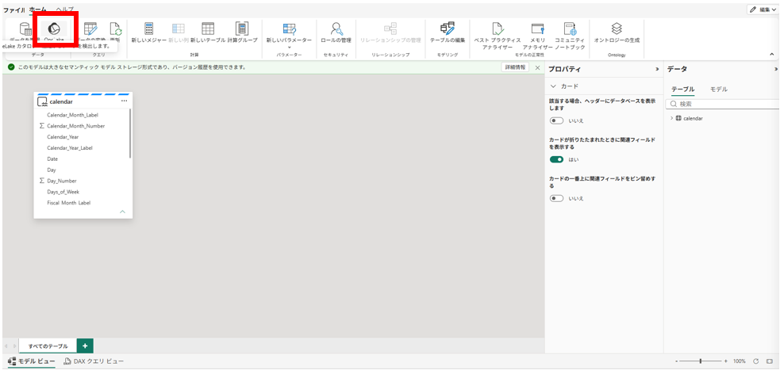

7. [pdpv2dwh＜No＞] を選択し、[接続] をクリックする。

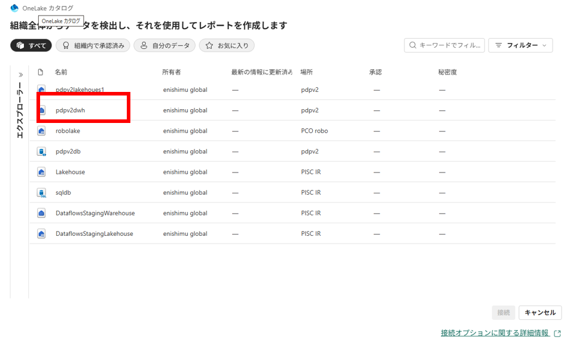

8. [データソースを追加する] が表示されるので [Fact\_Sale] テーブルにチェックを入れ、[確認] をクリックする。

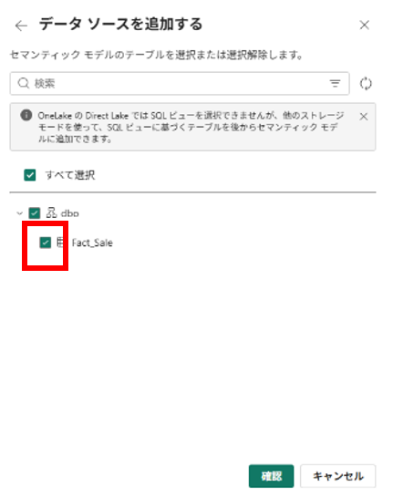

9. セマンティックモデルの [モデルビュー] に戻るので、[ホーム] のメニューにある [OneLake カタログ] をクリックする。

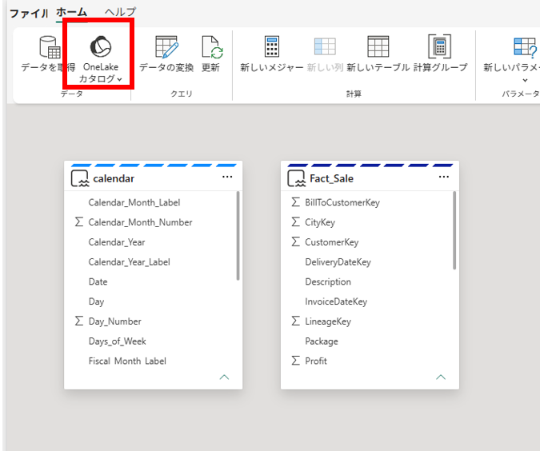

10. [pdpv2db] を選択し、[接続] をクリックする。

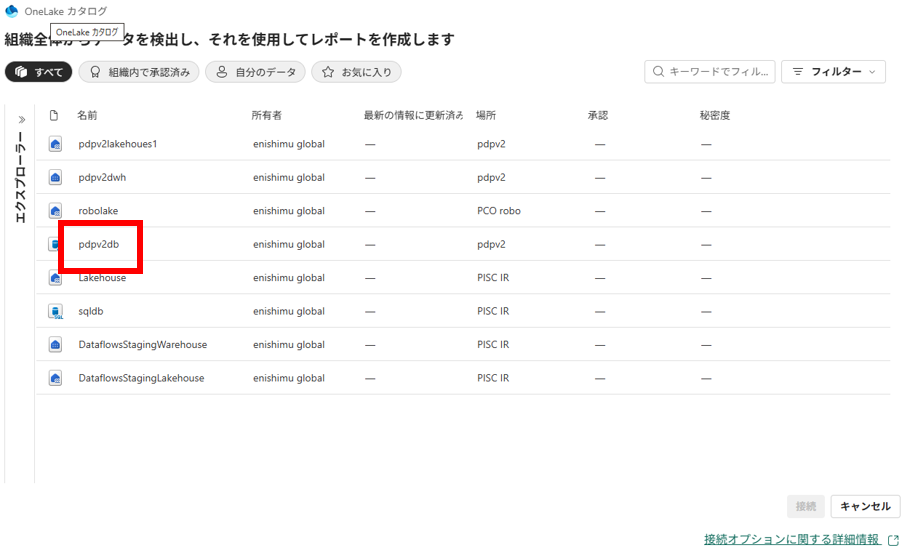

11. [データソースを追加する] が表示されるので [Integration] にチェックを入れ、配下の 4 つのテーブルにチェックが入っていることを確認して、[確認] をクリックする。

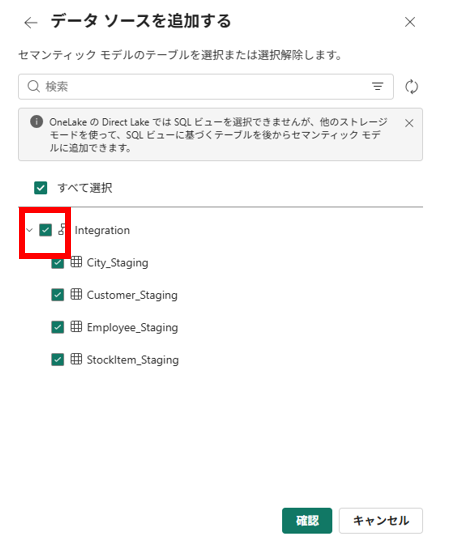

12. セマンティックモデルの [モデルビュー] に戻るので、[Fact_Sale] を中心にその他のテーブルを周囲に配置する。

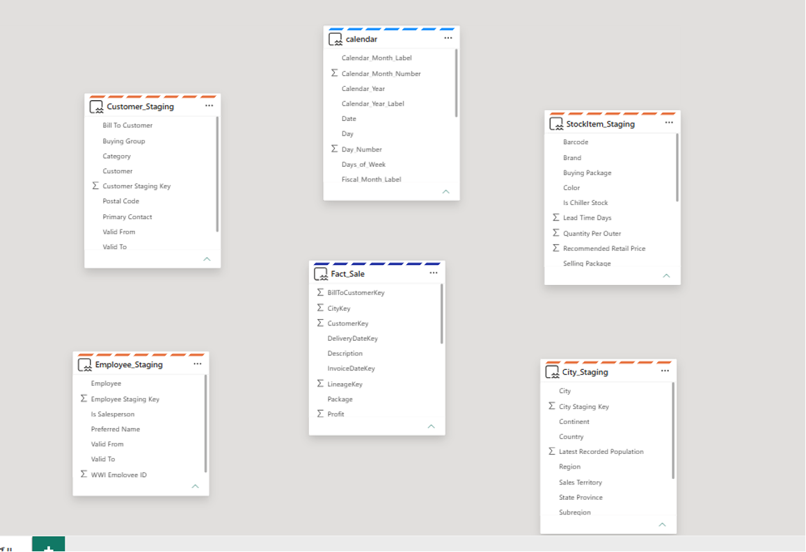

> ※ 配置については視認性向上のためのもので、機能や作業順に影響するものではない。
> ※ [Fact_Sale] を中心としたスタースキーマとなるので、ディメンションはどの位置でもよい。

13. [Fact_Sale] テーブルの [CityKey] 列をドラッグし、[City\_Staging] テーブルの [City Staging Key] 列にドロップする。

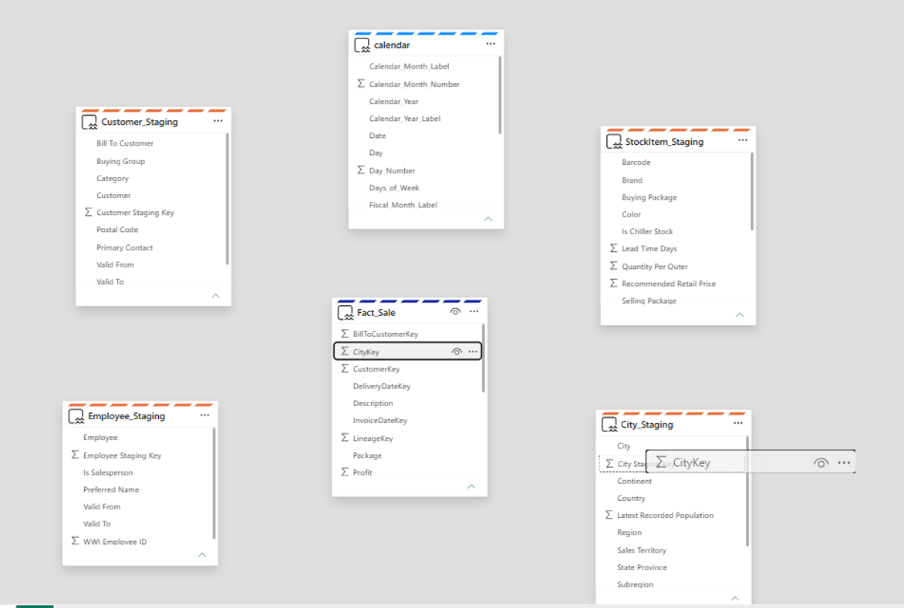

14. [新しいリレーションシップ] で次の内容を確認して、[保存] をクリックする。


| 属性                                     | 値                                                       |
| ---------------------------------------- | -------------------------------------------------------- |
| テーブルから                             | [Fact\_Sale] の [CityKey] が選択されている。             |
| テーブル表示                             | [City\_Staging] の [City Staging Key] が選択されている。 |
| カーディナリティ                         | 多対一                                                   |
| クロスフィルターの方向                   | 単一                                                     |
| このリレーションシップをアクティブにする | チェックが入っている。                                   |

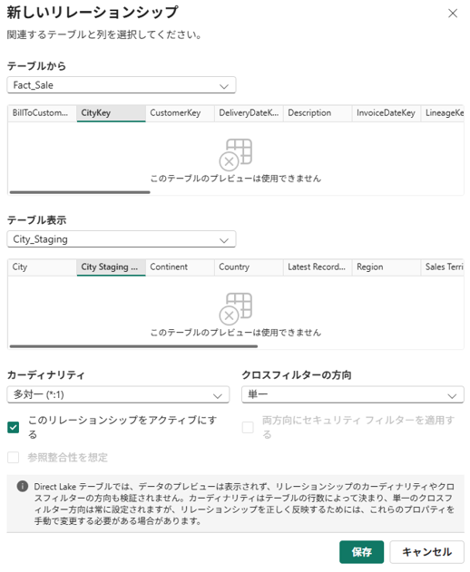

15. 前の手順 13, 14 と同様に次の内容でリレーションを作成する。

```
[Fact_Sale].[CustomerKey] - [Customer_Staging].[ Customer Staging Key]
[Fact_Sale].[StockItemKey] - [StockItem_Staging].[StockItem Staging Key]
[Fact_Sale].[SalespersonKey] - [Employee_Staging].[Employee Staging Key]
[Fact_Sale].[InvoiceDateKey] - [Calendar].[Date]
```

> ※ [カーディナリティ], [クロスフィルターの方向], [このリレーションシップをアクティブにする] は、すべて先と同じ内容にする。
> ※ ドラッグとドロップは逆にするとリレーションの方向も逆になるため注意する。

16. すべてのリレーションを作成したら、画面右上にある [編集] をクリックし、[表示中] に変更する。

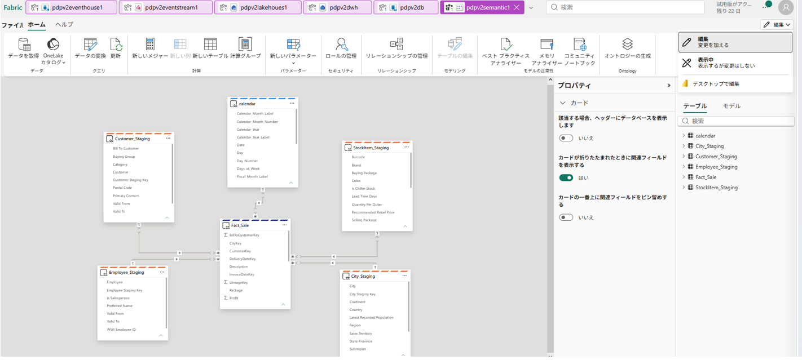

※ 編集モードで手を加えた内容は自動で保存されている。

17. リボンから  [オントロジーの生成] をクリックする。
    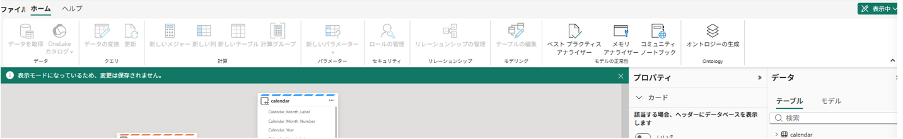
18. 次の内容で [オントロジー（プレビュー）] を作成する。

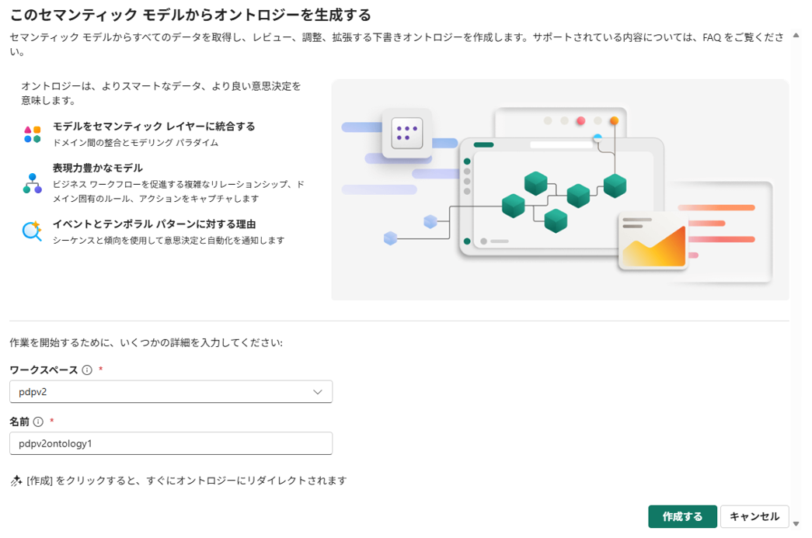

| 属性 | 値                   |
| ---- | -------------------- |
| 名前 | pdpv2ontology＜No＞ |

19. [pdpv2ontology＜No＞] が自動で開くので、画面左の [エクスプローラー] で [Fact_Sale] をクリックする。

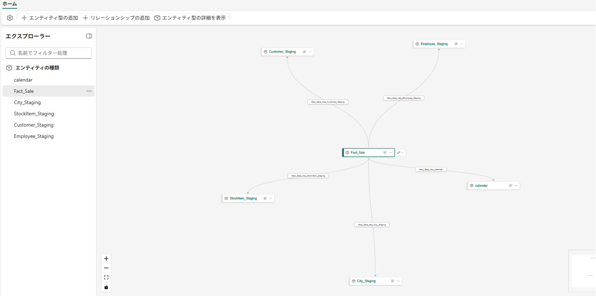

> ※ [Fact_Sale] を中心としたグラフ構造が見えることを確認する。
> ※ 本機能は現在プレビューとなっているため、この後では利用しない。
> ※ オントロジーを作成する際に [Ontology へようこそ] が表示されることがあるが、再度表示させたくない場合は [今後表示しない] にチェックを入れ画面を閉じる。

20. Fabric ポータル左のナビゲーションバーで [pdpv2ws＜No＞] のワークスペースをクリックする。
21. [＋新しい項目] をクリックし、次の内容で [データエージェント] を作成する。

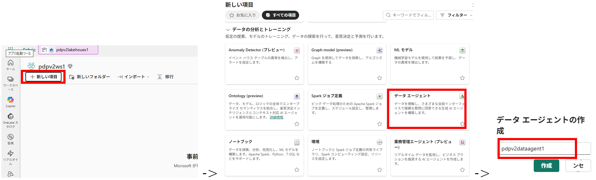

> ※ 新しい項目は、カテゴリで [データの分析とトレーニング] - [データエージェント] を指定する。


| 属性 | 値                    |
| ---- | --------------------- |
| 名前 | pdpv2dataagent＜No＞ |

※ Fabric 試用版容量ではデータエージェントが作成できない。

22. [pdpv2dataagent＜No＞] が自動で開くので、画面中央の [データソースの追加] をクリックする。

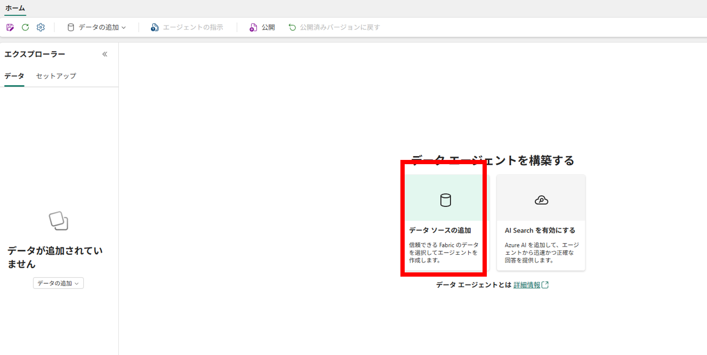

23. [データソースの追加] で [pdpv2semantic＜No＞] を選択し、[追加] をクリックする。

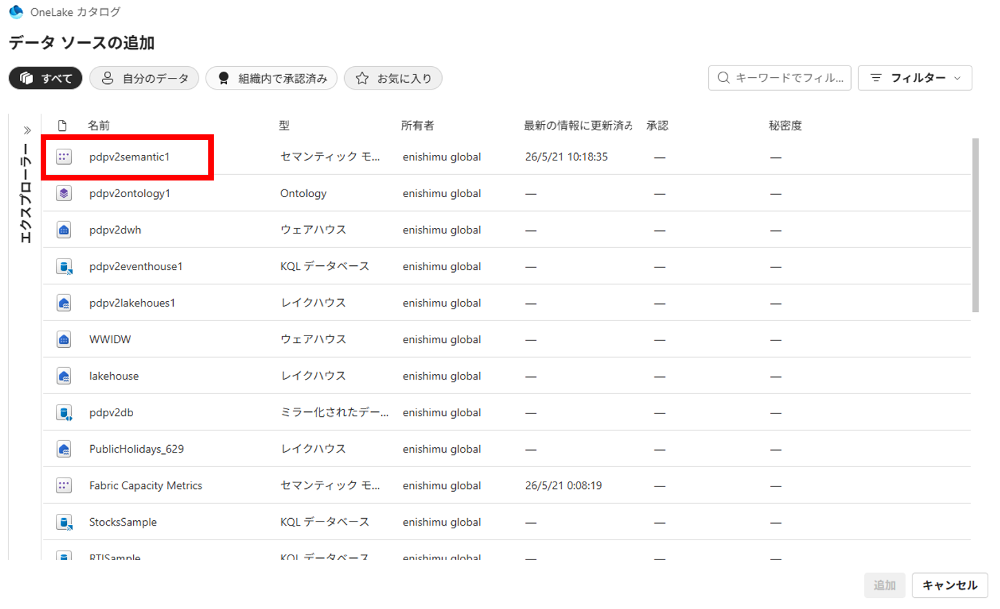

> ※ ここで先に作成したオントロジーを選択すると、エージェントがエンティティ間の関係性を考慮した回答を返すことができるようになる。但し、現在プレビューの機能であるため今回のハンズオンでは使用していない。

24. データとして [pdpv2semantic＜No＞] が追加されていることを確認し、[エクスプローラー] ですべてのテーブルにチェックを入れる。

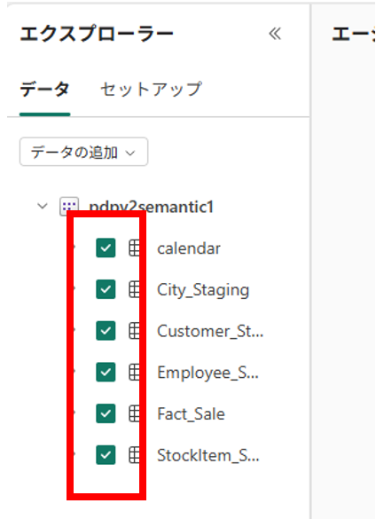

25. チャット欄で次の質問を投げてみる。

Employee 毎のProfitの合計を年毎に出して。
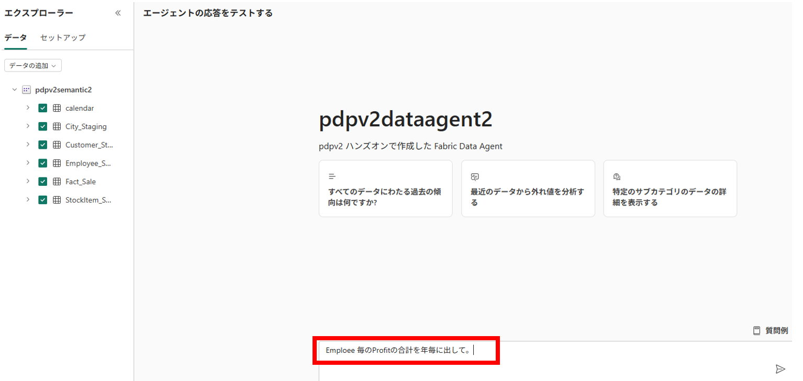

> ※ 質問内容は任意で投げてよい。
> ※ 各テーブルの項目名を日本語化していないため、質問を投げるときは英語の項目名を使うとよい。
> ※ 上記質問の結果例は次の通り。
> 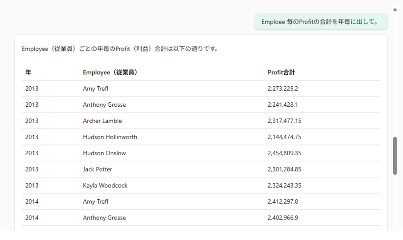

26. メニューの [公開] をクリックする。

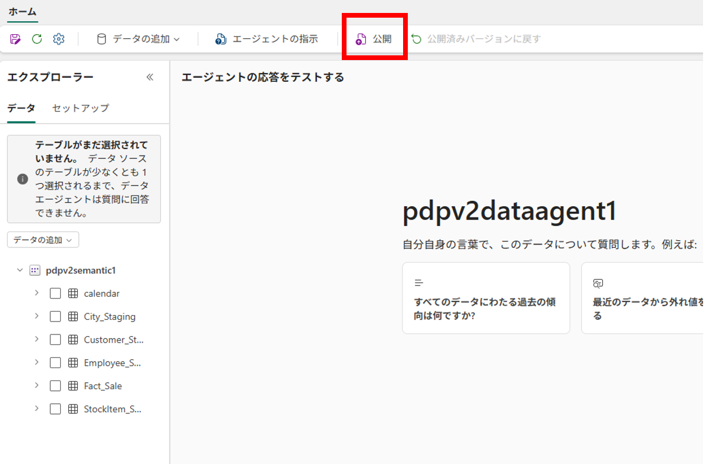

27. [目的と機能の説明] に次の内容を記載し、[公開] をクリックする。

pdpv2 ハンズオンで作成した Fabric Data Agent

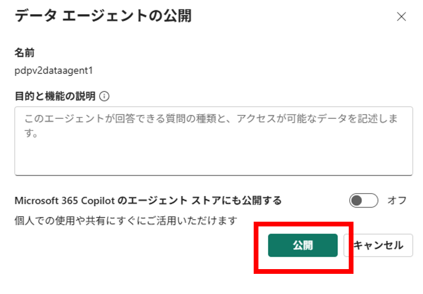

以上、お疲れさまでした。
